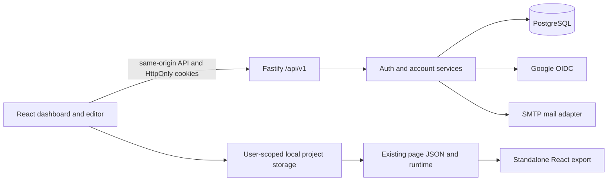

# Framewright SaaS foundation

Design recorded before authentication implementation, 2026-10-02. This extends the current runtime; the separate `docs/architecture` IR v2 proposal remains a proposal.

## 1. Existing architecture

- React 19/Vite SPA. `App` owns providers and dashboard/editor navigation. `PageContext` owns layouts, history, theme and portable project metadata. Zustand holds editor UI state.
- The dashboard added in this change stores multiple project snapshots beside the original active project in browser storage. Existing data is under `react-ui-builder:pages-state`.
- `runtime/project.js` validates Framewright v1 JSON; the registry/adapters decouple components from JSON. Preview and exported apps use the runtime. Authentication must not enter exported applications.
- The editor has theme variables but the initial dashboard has hardcoded dark colors. Extract shared tokens and controls; preserve independent artboard styling.
- `backend/` is an older Express/file-JSON prototype. It lacks real identities and per-user authorization. Its API-key length check is not security. The active page save/export path does not depend on that backend. Variants use its API with a browser cache fallback.
- Baseline: 33 frontend tests pass (including seven dashboard tests); production frontend builds. Existing ONNX eval/large bundle warnings remain.

## 2. Target architecture and boundaries



Use a modular monolith. HTTP routes validate inputs and map responses; services own business rules and transactions; database schema/connection, cryptography, OIDC and mail adapters are separate. Inject the database, mail and OIDC interfaces into app creation for integration tests. Future projects/components/preferences/AI/collaboration modules mount beside auth with the same authorization hook. No microservices, event bus or generic repository framework yet.

## 3. ADR: Node.js/TypeScript over Go

| Concern | Go | Node.js/TypeScript | Decision for Framewright |
|---|---|---|---|
| Maintainability | Small language, explicit errors, another language to maintain | Shared language/tooling with React; strict backend types | TypeScript |
| Performance | Efficient CPU work and concurrency | Suitable for I/O-driven auth/API; expensive hashes run asynchronously | Either is adequate; benchmark actual bottlenecks |
| Security | Strong standard library; still requires protocol expertise | Mature OIDC, Argon2 and HTTP libraries; dependency updates required | Use maintained libraries, no handwritten JWT/OIDC verification |
| Type safety | Compile-time Go types | Strict TypeScript plus runtime input validation and typed SQL | TypeScript fits existing JSON contracts |
| Ecosystem/OAuth | Mature OAuth/OIDC packages | OpenID-certified openid-client; Fastify/Drizzle | TypeScript |
| Productivity | New backend language and cross-language schemas | One toolchain, existing npm knowledge, injectable HTTP tests | TypeScript |
| Scalability | Strong single-process efficiency | Stateless API replicas with shared PostgreSQL sessions/rate limits | Both; choose modular boundaries first |
| Frontend compatibility | HTTP/JSON interoperable | HTTP/JSON plus shared language | TypeScript |

Select current stable Fastify 5, TypeScript, Drizzle PostgreSQL driver and openid-client 6; lock dependencies. No performance claims without measurements. [Fastify TypeScript](https://fastify.dev/docs/latest/Reference/TypeScript/), [openid-client](https://github.com/panva/openid-client).

## 4. Authentication flows

```mermaid
sequenceDiagram
  participant B as Browser
  participant A as Framewright API
  participant D as PostgreSQL
  participant G as Google
  B->>A: POST login (Origin + custom CSRF header)
  A->>D: Rate limit; look up local identity
  A->>A: Verify Argon2id hash
  A->>D: Create new session and hashed tokens
  A-->>B: HttpOnly access + refresh cookies, public profile
  B->>A: Protected request with access cookie
  A->>D: Check token expiry, session revocation and owner
  A-->>B: Data or 401
  B->>A: POST refresh after expiry
  A->>D: Atomically consume refresh generation, issue replacement
  A-->>B: New cookies (old-token reuse revokes the session)
  B->>A: POST Google start
  A->>D: Short-lived state, nonce, PKCE verifier, browser binding
  A-->>B: Google authorization URL; HttpOnly binding cookie
  B->>G: Code flow with state, nonce, S256 challenge
  G-->>A: Callback code and state
  A->>D: Atomically consume state and verify browser binding
  A->>G: Code exchange with PKCE verifier
  A->>A: Library verifies ID token issuer/audience/signature/nonce
  A->>D: Match provider subject, then create session
  A-->>B: HttpOnly cookies; redirect to fixed app URL
```

First-party registration creates a user/local identity with Argon2id. Email verification uses a hashed, expiring, single-use token. Login is allowed for unverified local accounts, with an explicit verification status; future sensitive/platform publishing APIs must use the verified-user guard. Reset requests return a generic response, issue a short-lived single-use token and revoke all sessions when consumed. Password changes require the existing password and revoke other sessions. Profiles can change display name/avatar; changing the account email is deferred until a separate verified-email-change flow is implemented.

Session strategy: opaque random access tokens (10 minutes) and refresh tokens (30-day absolute session lifetime). Store only hashes. A refresh generation is consumed in a transaction; replay revokes its session family. Cookies are HttpOnly, SameSite=Lax and Secure in production, no Domain. Never put auth tokens in localStorage or JS-readable cookies. Session APIs list devices and revoke owned sessions. Logout revokes the server session and clears both cookies. Frontend refresh is single-flight and coordinated between tabs where Web Locks is available.

Google email is not an account key: the verified provider subject is. Never automatically merge an existing local account based on matching email. An explicit authenticated, recent-session linking flow binds the OAuth transaction to that user/session. Unknown provider subjects with an existing email return an account-linking instruction, not a second user or automatic merge.

## 5. Database decision and schema

PostgreSQL is the production database: transactions, unique constraints, row locks, foreign keys and indexes support token rotation and later multi-user data. Drizzle provides typed queries and reviewable SQL migrations. Development/tests may use PGlite (embedded PostgreSQL) with the same schema and migrations, because Docker is installed here but its engine is not running. PGlite is rejected in production. [Drizzle PostgreSQL](https://orm.drizzle.team/docs/get-started-postgresql), [PGlite adapter](https://orm.drizzle.team/docs/get-started/pglite-new).

| Table | Key fields and constraints |
|---|---|
| users | UUID PK; normalized email unique; name; nullable avatar; emailVerifiedAt; createdAt; updatedAt |
| identities | UUID PK; userId FK; provider; providerUserId; nullable passwordHash; unique(provider, providerUserId); unique(userId, provider) |
| sessions | UUID PK; userId FK/index; accessHash unique; accessExpiresAt; absolute expiresAt; revokedAt; authenticatedAt; createdAt; lastSeenAt; user-agent device label |
| refresh_tokens | hash PK; sessionId FK/index; expiresAt; consumedAt; retained until session expiry to detect replay |
| account_tokens | hash PK; userId FK/index; purpose (verify/reset); expiresAt; consumedAt |
| oauth_transactions | stateHash PK; nonce; PKCE verifier; browserBindingHash; expiresAt; optional link userId/sessionId |
| rate_limits | keyed hash PK; count; expiresAt; atomic increment shared across API replicas |

FK cascade handles future administrative cleanup. Expiry is checked on every use regardless of cleanup timing. A maintenance command removes expired challenges/tokens/sessions/rate buckets. Migrations use a database migration lock; production startup does not silently modify schemas. Database credentials and signing/configuration secrets belong in environment/secret-manager injection, never commits or logs.

## 6. Backend structure

```text
server/
  src/app.ts                 # injectable app composition, headers/errors/hooks
  src/index.ts               # process entry, shutdown
  src/config.ts              # validated environment and production gates
  src/db/{schema,connection,migrate}.ts
  src/modules/auth/{service,routes,oauth,passwords}.ts
  src/modules/account/routes.ts
  src/shared/{errors,mail,security}.ts
  migrations/               # generated SQL + migration journal
  tests/                    # real SQL/API tests and OIDC protocol tests
```

Every new module receives dependencies at composition time. New endpoints live under `/api/v1`. Responses use `{ data }` or `{ error: { code, message }, requestId }`. Passwords, cookies, headers, email links and OAuth callback query strings must not be logged. Request logs use route templates and request IDs.

## 7. Frontend changes

- Shared light/dark surface, text, mint accent, border and typography tokens. Reuse the theme provider and toggle on both screens; retain the Framewright mark. Shared brand/control components where useful. Scope styling to product chrome so exported pages/artboards do not inherit it.
- AuthProvider restores a cookie-backed session; a protected boundary owns login/registration/reset/verification views and network recovery. Backend outage is shown explicitly, never treated as authentication success.
- `auth/client` adds credentials, CSRF headers, coordinated refresh and structured errors. Account view supports profile updates, verification resend, password change, linked identities and session revocation.
- Key PageProvider and variant caches by authenticated user. Logout clears in-memory editor state; it must not delete local work. Local project JSON is still local, not cloud-synced.
- Existing anonymous projects are offered as an explicit copy into the signed-in workspace; leave the original key intact. Never silently assign one device's legacy projects to whichever user signs in first.
- Exported app JSON and code contain no Framewright authentication dependency.

## 8. Security decisions and operational limits

- Enforce same-origin mutating requests plus a custom CSRF header and JSON bodies; no wildcard credentialed CORS. Google callback is the sole cross-site entry and requires a one-use browser-bound transaction. [OWASP CSRF](https://cheatsheetseries.owasp.org/cheatsheets/Cross-Site_Request_Forgery_Prevention_Cheat_Sheet.html).
- Argon2id parameters meet OWASP's current minimum (19 MiB, two iterations, parallelism one); use at least 12 characters and allow password managers/long passphrases. Bound input length before hashing. [Password storage](https://cheatsheetseries.owasp.org/cheatsheets/Password_Storage_Cheat_Sheet.html).
- Use IP and account rate limits, generic login/reset responses, dummy verification for unknown accounts, fixed trusted OAuth URLs, no arbitrary return URL. Do not trust proxy IP headers unless explicitly configured behind a trusted proxy.
- Validate inputs, restrict avatar URLs to HTTPS, avoid HTML email injection and token logging. CSP/Helmet on the API, host-level SPA CSP documented separately because the existing AI/WebAssembly/preview features require deliberate policy configuration.
- Never expose the legacy API-key prototype as a production backend. Preserve its source/data for migration; new authenticated modules are the supported platform entry point. Legacy component/variant APIs require a scoped migration before exposing them on the public API.
- Deployment requires HTTPS, real PostgreSQL, secrets injection, backups, SMTP delivery, Google credentials/consent and redirect configuration. Passing local tests is not independent penetration testing or a production rollout.

## 9. Implementation stories and acceptance criteria

| Story | Modules / change and reason | Risks | Acceptance tests |
|---|---|---|---|
| S1 shared product theme | theme.css/provider, Dashboard, UIBuilder, shared UI: one token system | Leaking chrome styles into artboard; inaccessible light colors | Both schemes, viewport checks, canvas/preview unchanged, original icon/name |
| S2 platform persistence | server config/db/app, SQL migrations: real relational foundation | schema drift, weak production config | Typecheck; migration from empty DB twice; constraints; readiness; fail-closed config |
| S3 local authentication | auth service/routes/passwords/security/mail | enumeration, brute force, hash leakage, CSRF | Register/login; bad credentials; expired/replayed tokens; rate limiting; reset/verification single use |
| S4 Google OIDC | OIDC adapter and browser-bound transaction service | CSRF/replay, bad JWT claims, email linking takeover | Code+PKCE; state/binding/nonce failure; subject linking; callback reuse; provider error |
| S5 accounts and sessions | account routes/profile/session APIs | cross-user access, stale access after logout/reset | Unauthorized requests; user A cannot revoke B; rotation concurrency; logout/all-devices |
| S6 frontend integration | AuthProvider/routes/forms/account, storage scoping/API client | lost legacy work; auth flicker; refresh loops; cross-account cache | Protected route and loading/error tests; persistence/reload; explicit legacy copy; logout/login; refresh retry once |
| S7 regression/security review | docs, test suites, browser, dependency audit | export breakage, deployment assumptions | Existing tests/build; backend tests/typecheck; dashboard/editor visual smoke; documented setup and limitations |

Each story is implemented incrementally, with progress notes describing affected files, regression risks and checks. No changes to the working renderer, validators, component contracts or export format are planned.

## 10. Migration and rollout plan

1. Keep existing `backend` files, proposed docs and browser project data. Add new server independently; do not transform the project IR.
2. Apply versioned auth migrations to a new PostgreSQL database. Use embedded PostgreSQL only for local development/tests.
3. Run Vite with same-origin `/api/v1` proxy to the new backend. Keep legacy APIs out of the production reverse proxy. Fail closed when auth cannot be restored.
4. Introduce per-user browser keys. Show explicit legacy-copy action; validate copies before writing, preserve history and original backup. Export JSON remains available.
5. Deploy API and SPA behind the same HTTPS origin; configure cookies, SMTP and Google console redirect. Run real-provider staging checks before public release.
6. Future cloud project migration uses explicit upload/import with ownership assigned by the authenticated server, never a client-supplied user ID. Variants/components similarly need per-user ownership before cloud exposure.
7. Rollback frontend/server together; original project storage remains intact. Never roll back password/token schemas destructively; restore from verified database backup if required.

## Progress

- Design and impact assessment recorded before S1–S7 implementation.
- Implemented S1–S6: dashboard/project library, shared theme, per-account browser storage, SQL auth platform, Google OIDC adapter, email/password flows, and account/session controls. Existing project format and runtime exports are preserved.
- Automated verification: 40 frontend tests and frontend production build pass; backend authentication/OIDC integration tests and TypeScript build pass. Deployment tests cover static assets, protected APIs, hidden-file denial and Render origin selection.
- Render Blueprint and deployment/Google setup guide added. Production serves the SPA and API at one origin. Live Render PostgreSQL, Google and SMTP verification remain deployment acceptance tasks because provider credentials have not been configured here.
- Security review: backend runtime dependency audit reports no known vulnerabilities. Development dependencies still report four moderate advisories. Existing ONNX dependency requires dynamic evaluation; the CSP permits it and HTTPS model/API requests. Isolating browser inference would allow tightening this policy.
- Mail delivery is immediate, with resend after failure; there is no durable mail outbox yet. Generic account responses reduce enumeration, but delivery timing is not equalized. Projects/variants remain local; the old unowned backend is excluded from deployment. Full visual acceptance across viewports remains pending.
