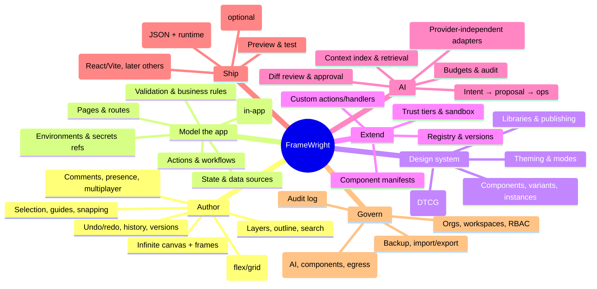

# 01 · Product capability map

FrameWright's promise: **Figma-grade direct manipulation over real application semantics, with every change (human, AI or plugin) expressed as a validated operation on an open, portable Project IR.**

## Personas

| Persona | Goal | Today's pain (in other tools) |
|---|---|---|
| **Product designer** | Lay out production screens fast, with the team's design system | Designs are pictures; hand-off loses behaviour; dev rebuilds everything |
| **Frontend developer** | Get maintainable code or a runtime they control; plug in company components | Generated code is unidiomatic, absolute-positioned, or locked to a SaaS runtime |
| **Citizen developer / BA** | Build forms, workflows, CRUD screens with rules and validation without code | Internal-tool builders are ugly and rigid; website builders don't understand data |
| **Design-system owner** | Publish approved components/tokens, control who may use what | Tools accept any component; no governance or versioning |
| **Org admin / security** | SSO, roles, audit, data residency, AI policy | AI features send whole projects to one vendor; no audit of AI changes |
| **AI agent (non-human actor)** | Propose changes through a narrow, typed interface | Free-form code generation that bypasses review |

## Capability map

## Capability layers and phase

| Layer | Capability | P0 (foundation) | P1 | P2 | P3 |
|---|---|---|---|---|---|
| Core model | Project IR v2, operations, validation, migrations | ✔ | | | |
| Core model | Unified component manifest registry (built-ins) | ✔ | | | |
| Editor | Op-driven canvas edits, transactional undo/redo | ✔ | | | |
| Editor | Auto-layout controls, smart guides, multi-select, copy/paste | partial | ✔ | | |
| Editor | Infinite canvas with multiple frames/breakpoints | | ✔ | | |
| Editor | Components/instances/variants with overrides | | ✔ | | |
| AI | Orchestrator with provider adapters, ChangeSet review | ✔ (1–2 providers) | routing, fallback | budgets per org | multi-agent flows |
| AI | Context index for large projects | outline only | ✔ | embeddings | |
| Extend | Org components (T1) via manifest + sandboxed canvas | | ✔ | | |
| Extend | Marketplace (T2/T3) | | | ✔ | |
| Data/cloud | Local-first persistence + JSON export | ✔ | | | |
| Data/cloud | Accounts, orgs, cloud projects, versions | | ✔ | | |
| Collab | Comments, presence | | ✔ | | |
| Collab | Real-time co-editing | | | ✔ | |
| Ship | Runtime-mode export (exists) on IR v2 | ✔ | | | |
| Ship | Deterministic React code export | | ✔ | | |
| Ship | Next.js / RN / static renderers | | | ✔ | Vue/Angular |
| Govern | RBAC, audit, SSO | | basic | SSO/SCIM | |

## What makes it different (summary of [02](02-competitive-research.md))

1. **Semantic canvas.** A form is a form, not a group of rectangles: validation, data binding, permissions and actions are visible and editable on the canvas (a "logic lens").
2. **Operations, not code, are the unit of change.** Humans, AI, plugins and collaborators all emit the same typed ops, so review, undo, audit and sync come for free and no AI can bypass them.
3. **Bring-your-own everything.** Your components (manifest contract), your tokens (DTCG), your AI provider (adapter layer), your hosting (clean export or runtime). Nothing requires the SaaS to keep running.
4. **Governed extensibility.** Trust tiers and sandboxing make it safe for enterprises to plug in internal components and still let a marketplace exist.
