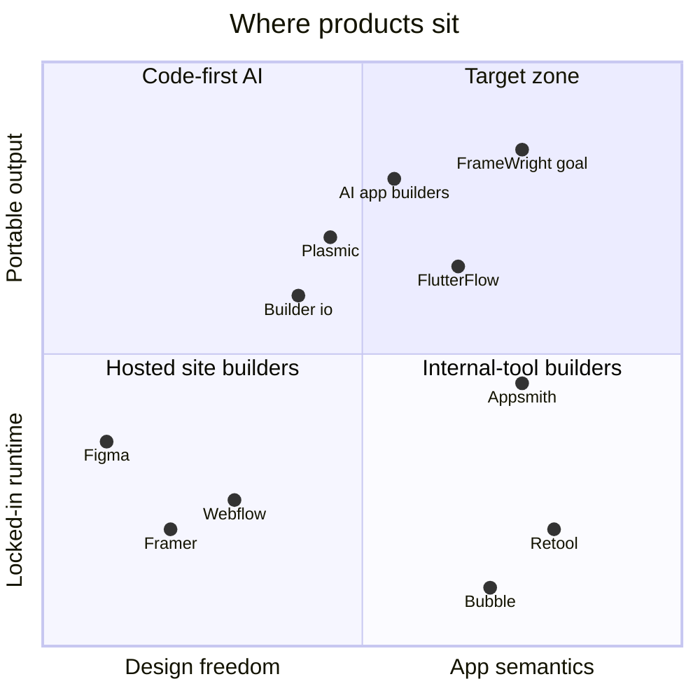

# 02 · Competitive and R&D findings (Workstream 14)

> **Source note.** This analysis is from product knowledge up to mid-2026 and the public positioning of each product, not from fresh hands-on testing or live web research in this session. Pricing and feature claims move fast; spike S-12 in [19](19-spikes.md) re-verifies the ones that drive decisions.

## Category map

## Per-product findings

| Product | Does well / devs like | Common complaints | Architectural limit & lock-in | Extensibility | AI | Collab | Code export |
|---|---|---|---|---|---|---|---|
| **Figma** | Speed of direct manipulation; auto-layout; components/variants; multiplayer; plugins; dev mode | Output is a picture; dev hand-off still manual; auto-layout ≠ real CSS in edge cases | Custom renderer; files proprietary; no semantics (data, state, rules) | Plugin API (sandboxed JS + iframe UI) | Generation features (Make/"First Draft"-style) produce designs or prototypes, not governed app models | Best-in-class | Dev Mode snippets, not an app |
| **Framer** | Beautiful sites fast; CMS; React code components | Site-oriented; app logic limited; hosting tied | Hosted runtime | React code components | Site generation | Good | Limited/none |
| **Webflow** | CSS box-model fidelity for designers; CMS; hosting | Complexity; pricing; app logic weak | Hosted; export drops CMS/interactions | DevLink, apps | Some generation | Limited | HTML/CSS export (partial) |
| **Builder.io** | Visual CMS on your own React components; Figma→code | Setup complexity; editor feels CMS-like | SDK/runtime fetches content from their API | Register your components | Visual Copilot / code agents | Moderate | Generated code + SDK |
| **Plasmic** | Works with codebase components; loader *or* codegen; open source | Learning curve | Loader mode depends on their CDN; codegen avoids it | Code components registration (closest analogue to our manifest) | Some | Moderate | Codegen available |
| **Retool / Appsmith / ToolJet** | Fast CRUD over data sources; queries; permissions | Look "internal"; hard to style; runtime lock-in (Retool) | Proprietary runtime (Appsmith/ToolJet are open source, self-hostable) | Custom widgets in iframes | Query/app generation | Basic | Weak or none |
| **Bubble** | Full-stack no-code incl. DB and workflows | Performance, lock-in, no export | Fully hosted runtime | Plugins | AI app generation | Basic | None |
| **FlutterFlow** | Visual Flutter with real code export; Firebase integration | Complex state; generated code is verbose | Flutter only | Custom widgets/code | Generation features | Teams | Yes (Flutter) |
| **Locofy / Anima** | Design→code from Figma | Code quality varies; one-shot | Converter, not a model | Limited | Core feature | n/a | Yes |
| **v0 / Lovable / Bolt** | Prompt → working app in minutes | Hard to iterate precisely; drifts; code quality varies with size; no design-system governance | Output is raw code; editing = more prompting; model-vendor coupling | Via code | Core | Basic | Yes (full code) |
| **SDUI platforms** (Airbnb-style internal, DivKit, your `SDUI`) | UI changes without app releases; strong typing | Engineering-only authoring; no visual editor | Needs matching client runtime | Registries | n/a | n/a | n/a (runtime) |

## Patterns worth taking

- **Figma**: auto-layout as the default mental model; components with instance overrides; variants as a property matrix; keyboard-first; multiplayer as a first-class concern; plugins sandboxed away from the document.
- **Plasmic / Builder.io**: let teams register *their own* React components with a typed prop contract, and let the output be either a loader/runtime or generated code.
- **Retool/Appsmith**: data sources, queries and permissions as first-class objects.
- **v0/Lovable**: the speed of intent → result. We keep the speed and replace "raw code" with "reviewable operations".
- **SDUI**: the IR itself is a server-drivable UI; the runtime already exists (`src/runtime`, and the user's `SDUI` package).

## Pain points no one solves well (the openings)

1. **AI output is not governable.** Prompt-to-code tools produce code nobody reviews structurally, and design tools produce pictures. No one offers "AI proposes typed changes → diff review → accept selected" on an application model.
2. **Design ↔ app semantics gap.** Designers can't express validation, data or permissions; app builders can't give designers Figma-quality editing.
3. **Lock-in vs. convenience.** Either a hosted runtime (Bubble, Retool) or a one-shot code dump (v0). Almost no one offers *both* a live runtime *and* clean ejectable code from the same model.
4. **Enterprise design-system governance.** Few tools treat components as versioned, permissioned, trust-tiered packages.
5. **Model vendor independence.** AI builders are tied to one or two model vendors; enterprises want BYO model, local models, and audit.

## Differentiation bets (ranked)

| # | Bet | Why defensible | Depends on |
|---|---|---|---|
| 1 | Operation-based AI with code-review-style approval | Requires an op-native core; bolting this onto a code-gen tool is hard | IR v2 + ops ([11](11-project-ir.md)) |
| 2 | Semantic canvas (logic lens, forms/rules/data visible in place) | Requires semantics in the model, not just visuals | IR semantics layer |
| 3 | BYO components with trust tiers + sandbox | Enterprise trust; marketplace later | Manifest + sandbox ([04](04-component-plugin-architecture.md)) |
| 4 | Dual output: runtime JSON *and* deterministic code | Removes lock-in objection | Emitter pipeline |
| 5 | Provider-independent AI incl. local models | Enterprise policy, cost control | Orchestrator ([05](05-ai-orchestrator.md)) |

What we deliberately **don't** compete on: vector illustration, marketing-site animation, full backend/DB hosting (Bubble), or being a general code IDE.
