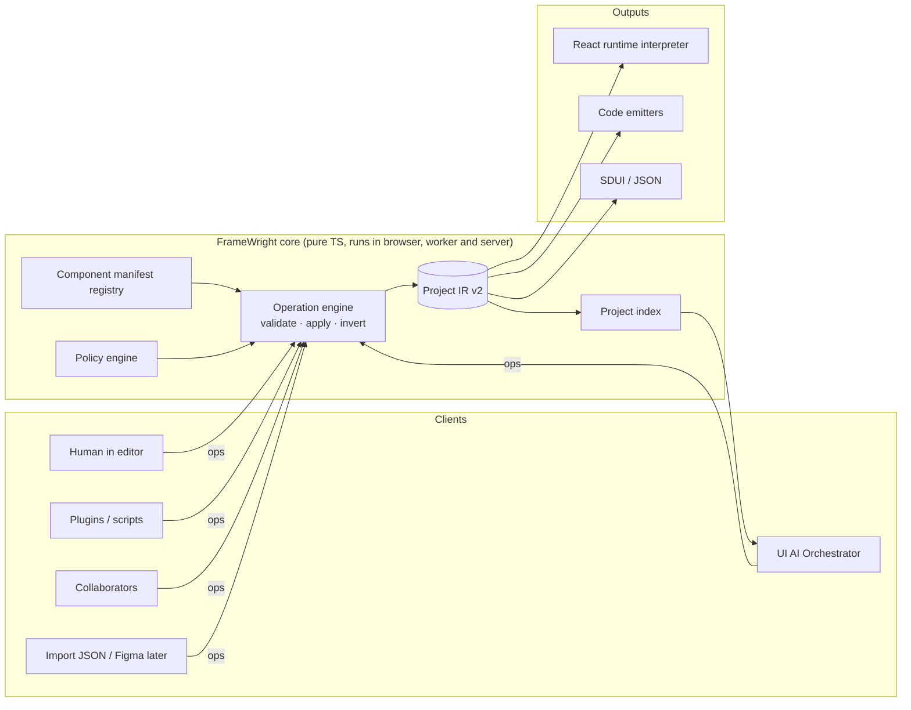
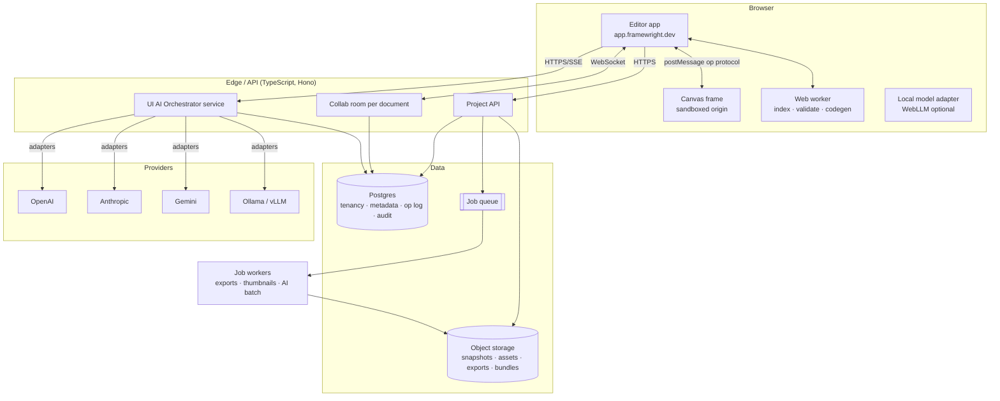

# 03 · Proposed high-level architecture

## One sentence

A **deterministic core** (Project IR + operation engine + component manifests + policy) sits at the centre; the **editor**, the **UI AI Orchestrator**, **collaboration**, **import** and **plugins** are all *clients* that submit operations to it; **renderers** and **emitters** are pure functions of the IR.

## Context

## Containers (target, stage 2)

In **stage 1** only the Browser box exists (plus an optional stateless orchestrator function for cloud models); see [08](08-deployment-architecture.md).

## Module boundaries (proposed code layout)

New code goes into TypeScript packages inside this repo (a workspace can come later; folders first, to avoid premature tooling):

| Module | Path | Depends on | Must not depend on |
|---|---|---|---|
| `ir` – schema, types, migrations v1→v2, serializer | `src/core/ir/` | zod | React, DOM, editor |
| `ops` – operation schemas, `apply`, `invert`, `validate`, transactions | `src/core/ops/` | ir, registry, policy | React, network |
| `registry` – component manifest schema, built-in manifests, resolver | `src/core/registry/` | ir | React (implementations are referenced by id, not imported) |
| `policy` – project/org policy evaluation | `src/core/policy/` | ir | network |
| `index` – outlines, symbol index, search | `src/core/index/` | ir | React |
| `runtime` – interpreter renderer (exists) | `src/runtime/` | ir, registry | editor |
| `emit` – code emitters (react-vite first) | `src/emit/` | ir, registry | editor |
| `editor` – UI shell, canvas host, inspector | `src/builder/` (existing) | everything above | provider SDKs |
| `orchestrator` – UI AI Orchestrator | `src/orchestrator/` → later its own package/service | ir (types), ops (schemas), index | editor, React, any provider SDK (only adapters may) |
| `orchestrator/adapters/*` | per provider | provider SDK or fetch | core logic |

**Rules** (to be enforced by a lint/dependency test, as Switchboard's `ArchitectureTests` does):
1. `src/core/**` imports nothing from `src/builder/**`, React or network code.
2. No provider/vendor name appears outside `src/orchestrator/adapters/**`.
3. Every write to project state goes through `ops.apply`. There is no second path.

## Key flows

### Human edit
Canvas gesture → `ops.build(...)` → `ops.validate` (schema + registry + policy) → `apply` returns `{nextDoc, inverse}` → store commits a transaction (undo entry = inverse ops) → renderers re-render only touched nodes → persistence appends ops (local now, server later).

### AI edit
Prompt → Orchestrator retrieves context from the index → provider returns a structured proposal → orchestrator compiles it into a **ChangeSet** of ops → core validates in *dry-run* → editor shows diff review → user accepts all/selected → the accepted ops are applied as **one transaction** labelled with the AI run id. See [05](05-ai-orchestrator.md), [06](06-ai-guardrails.md).

### Export
IR → (runtime mode) `app.config.json` + runtime package, or (code mode) emitter → files → formatter → ZIP/Git. Both are pure and deterministic. See [11](11-project-ir.md).

## Architecture principles as concrete invariants

| Principle | Invariant |
|---|---|
| Deterministic state | Same IR + same op sequence ⇒ same IR, byte-for-byte serialisation (sorted keys, stable ids). |
| Secure by default / zero implicit trust | JSON never contains code; untrusted component code never runs in the editor origin; AI output is data until validated and approved. |
| Provider independence | Core + editor compile without any AI SDK installed. |
| Schema-driven contracts | IR, ops, manifests, orchestrator protocol each have a versioned JSON Schema generated from zod and committed under `docs/schema/`. |
| Backward compatibility | Every schema bump ships a migrator and golden-file tests; old files always import. |
| Auditability | Every applied transaction records actor (user/AI run/plugin), timestamp, ops. |
| Avoid premature distribution | One core library reused in browser, worker and server; services are split only at the boundaries in the container diagram, and only when a stage needs them. |
