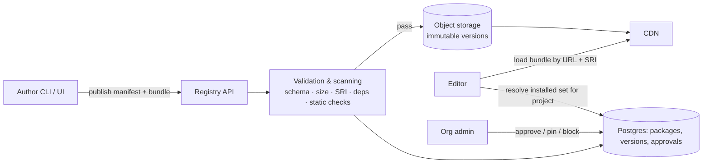

# 04 · Component and plugin architecture (Workstream 3)

## Problem and personas

Design-system owners and developers must add components (custom, imported React, internal, marketplace) **without redeploying the builder**, and without letting that code compromise the editor or another tenant. Today there are four registries hard-coded at build time ([00](00-current-state.md#structural-gaps-what-the-architecture-must-fix)).

| Persona | Needs |
|---|---|
| Developer | Wrap an existing React component, declare props, publish |
| Design-system owner | Approve, version, deprecate; restrict by team |
| Designer / BA | Find components, edit props safely, never see a broken canvas |
| Org admin | Know what third-party code runs, where, with what access |

## Decision summary

1. **Manifest-first.** A component is a *manifest* (pure JSON, validated) plus an optional *implementation bundle* (ESM). The editor, inspector, AI, validator and emitters read only the manifest. Only renderers load the bundle. → [ADR-0005](adr/0005-component-manifest-and-trust-tiers.md)
2. **Runtime loading of ESM bundles by URL from a registry**, not Module Federation. → alternatives below.
3. **Trust tiers decide where code runs.** Untrusted code never executes in the editor origin. → [ADR-0006](adr/0006-untrusted-code-cross-origin-sandbox.md)
4. **Schema-only components** (compositions of existing components + tokens, no code) are the preferred way for non-developers and AI to "create components"; they need no sandbox at all.

## Component contract (manifest v1)

```jsonc
{
  "$schema": "https://framewright.dev/schema/component-manifest.v1.json",
  "id": "acme.kyc-upload",            // namespace.name — globally unique, immutable
  "version": "2.3.0",                 // semver of the contract, not only the code
  "displayName": "KYC document upload",
  "category": "Forms",
  "source": {                          // where the implementation comes from
    "kind": "bundle",                  // builtin | bundle | composition
    "url": "https://registry.framewright.dev/acme/kyc-upload/2.3.0/index.mjs",
    "integrity": "sha384-…",           // SRI; mandatory for bundle
    "exportName": "KycUpload",
    "npm": { "package": "@acme/ui", "export": "KycUpload", "range": "^2.3.0" }  // used by code export
  },
  "trust": "org-approved",             // assigned by the registry, never by the author
  "props": {                           // JSON Schema 2020-12 subset
    "type": "object",
    "properties": {
      "label":     { "type": "string", "maxLength": 120, "x-fw-control": "text", "x-fw-bindable": true },
      "documentTypes": { "type": "array", "items": { "enum": ["passport", "license", "id"] } },
      "maxSizeMb": { "type": "number", "minimum": 1, "maximum": 20, "default": 5 },
      "tone":      { "$ref": "#/$defs/tone", "x-fw-token": "color" }
    },
    "required": ["label"],
    "additionalProperties": false
  },
  "defaultProps": { "label": "Upload ID", "documentTypes": ["passport"] },
  "editor": {                          // inspector grouping / controls; optional
    "groups": [{ "title": "Content", "props": ["label", "documentTypes"] }],
    "icon": "upload", "previewImage": "…/preview.png"
  },
  "slots": { "help": { "accepts": ["text", "link"], "max": 1 } },     // named children
  "events": { "uploaded": { "payload": { "type": "object", "properties": { "fileId": { "type": "string" } } } } },
  "actions": { "reset": { "params": {} } },                          // imperative methods callable from logic
  "formField": { "valueType": "object", "validation": ["required"] },   // participates in form state
  "variants": { "size": ["sm", "md"], "state": ["default", "error"] },
  "tokens": ["color.brand", "radius.md"],                            // tokens it reads
  "permissions": { "network": [], "storage": false, "clipboard": false },  // capabilities requested
  "validation": [{ "rule": "maxSizeMb <= 20" }],                       // declarative only
  "compatibility": { "framewright": ">=2.0 <3", "renderers": ["react-web"], "react": ">=18" },
  "dependencies": { "components": ["core.text@^1"], "peer": { "react": ">=18" } },
  "runtime": { "ssr": false, "requiresDom": true, "lazy": true, "maxBundleKb": 150 },
  "migrations": [{ "from": "1.x", "to": "2.0.0", "ops": [{ "rename": ["title", "label"] }] }],
  "docs": { "summary": "…", "url": "…", "aiHint": "Use for identity document capture in KYC flows." },
  "deprecated": null
}
```

Notes:
- `id` + major version is the IR reference (`"type": "acme.kyc-upload@2"`). Minor/patch upgrades apply automatically; major upgrades need declarative `migrations` (rename/remove/default/map) or an explicit user migration. This generalises today's `contractVersion` + `migrate(props, fromVersion)` in `src/runtime/registry.jsx` but keeps migrations **declarative** so they can run on the server and in the orchestrator without executing third-party code.
- `props` is the single source for inspector controls, AI allow-lists (replacing `ai/registry/components.ts`), validation and TypeScript types in code export.
- `x-fw-*` keywords carry editor hints; unknown keywords are ignored for forward compatibility.
- Built-ins become manifests with `source.kind: "builtin"` and `id: "core.button"`; IR v1 type `button` maps to `core.button@1` in the v1→v2 migration.

## Registry



- **Scopes**: `core` (built-in), `org:<id>` (private to an org), `public` (marketplace).
- **Installation** is per project (a lockfile in the IR: `components: { "acme.kyc-upload": "2.3.0" }`), so a project renders identically until someone upgrades — like `package-lock.json`.
- **Versions are immutable**; yanking marks a version unusable for new installs but keeps existing projects rendering (with a warning).

## Trust tiers and isolation

| Tier | Who | Where code runs in the **editor** | Where it runs in **exported / hosted apps** | Gate |
|---|---|---|---|---|
| **T0 built-in** | FrameWright | Canvas frame (same bundle as the runtime) | Bundled | Our code review + CI |
| **T1 org-approved** | Org developers, approved by org admin | Canvas frame on the sandbox origin, shared realm with T0 | Bundled into the org's app | Admin approval, SRI, scan, signed publish |
| **T2 marketplace** | Third parties, reviewed | Canvas frame on sandbox origin, **per-package** nested iframe when interactive; props passed via postMessage | Bundled only after the org installs it explicitly | Automated scan + manual review + publisher identity |
| **T3 untrusted / private experiments** | Any user (incl. AI-authored code) | **Never live in the canvas by default.** Rendered in an isolated per-instance iframe (`sandbox="allow-scripts"`, opaque origin, no network via CSP `connect-src 'none'`) or as a static placeholder with a screenshot | Not exportable until promoted to T1 | Owner opt-in per project |
| **Composition (no code)** | Anyone, AI | Normal rendering (it's just IR) | Normal | IR validation only |

The critical boundary is the **canvas frame on a separate registrable domain** (e.g. `*.fw-usercontent.net`): it holds no session cookies or tokens, talks to the editor only through a typed postMessage protocol whose messages are validated like ops, and has a strict CSP. This is what lets T1/T2 code run with Figma-like fidelity while the editor (which holds credentials) stays untouched. P0 keeps T0 only, so the canvas may remain same-origin until P1 — but the canvas host ↔ frame protocol is defined in P0 so the move is mechanical ([15](15-conflicts-and-resolutions.md#c1-figma-like-editing-vs-dom-rendering-vs-sandboxing)).

## Plugins (beyond components)

Same model, different extension points, all declared in a manifest with requested permissions:
- **Action handlers** (replacing ad-hoc `custom` handlers): run in exported apps only; in the editor they run in a worker/sandbox with a mocked environment.
- **Validators, formatters, data-source connectors**: declarative first; code only at T1+.
- **Editor plugins** (panels, generators): Figma-style — plugin runs in a sandboxed iframe/worker, reads a *view* of the IR and can only submit ops (which go through the same validation and undo as humans). They can never touch the DOM of the editor.

## Research notes: alternatives

| Approach | Verdict | Why |
|---|---|---|
| Hard-coded imports (today) | Reject for extensibility | Requires redeploy |
| **Module Federation** (webpack/Vite plugin) | Reject as the primary mechanism | Couples the host build to remote builds (shared-scope versioning, React singleton issues); remotes run in the host realm with full access; great for first-party micro-frontends, wrong for untrusted tenants |
| **ESM bundles by URL + import maps** (externals: react, react-dom, `@framewright/runtime`) | **Choose** | Standard, CDN-friendly, lazy by nature, host-build independent; combine with SRI and origin isolation for security |
| npm install at build time | Use for **code export** only | Correct for ejected apps (`source.npm`), impossible at editor runtime |
| Web Components | Optional wrapper | Useful for framework-agnostic renderers later; poor React prop/event ergonomics today |
| ShadowRealm / SES (Hardened JS) | Watch (spike S-06) | Stronger in-realm isolation would allow T2 without iframes; not broadly shipped in browsers |
| Server-side rendering of untrusted components | Reject for editor | Moves the attack to our servers |

## BA view

- **Pain points**: redeploy per component; no governance; AI can't know new components.
- **Desired behaviour**: publish → approve → install → appears in palette, inspector, AI, export within one minute; no builder deploy.
- **Dependencies**: IR v2 type references, sandbox origin, registry API (stage 2), object storage + CDN.
- **Security**: SRI, CSP, origin isolation, capability permissions, signed publishes, dependency scanning ([12](12-security-threat-model.md)).
- **Scalability**: bundles are immutable and CDN-cached; the editor lazy-loads only components used on visible frames; the palette virtualises lists; AI sees only manifest summaries relevant to the request ([13](13-scalability.md)).
- Stories: epic **E3** in [17](17-epics-and-stories.md).
