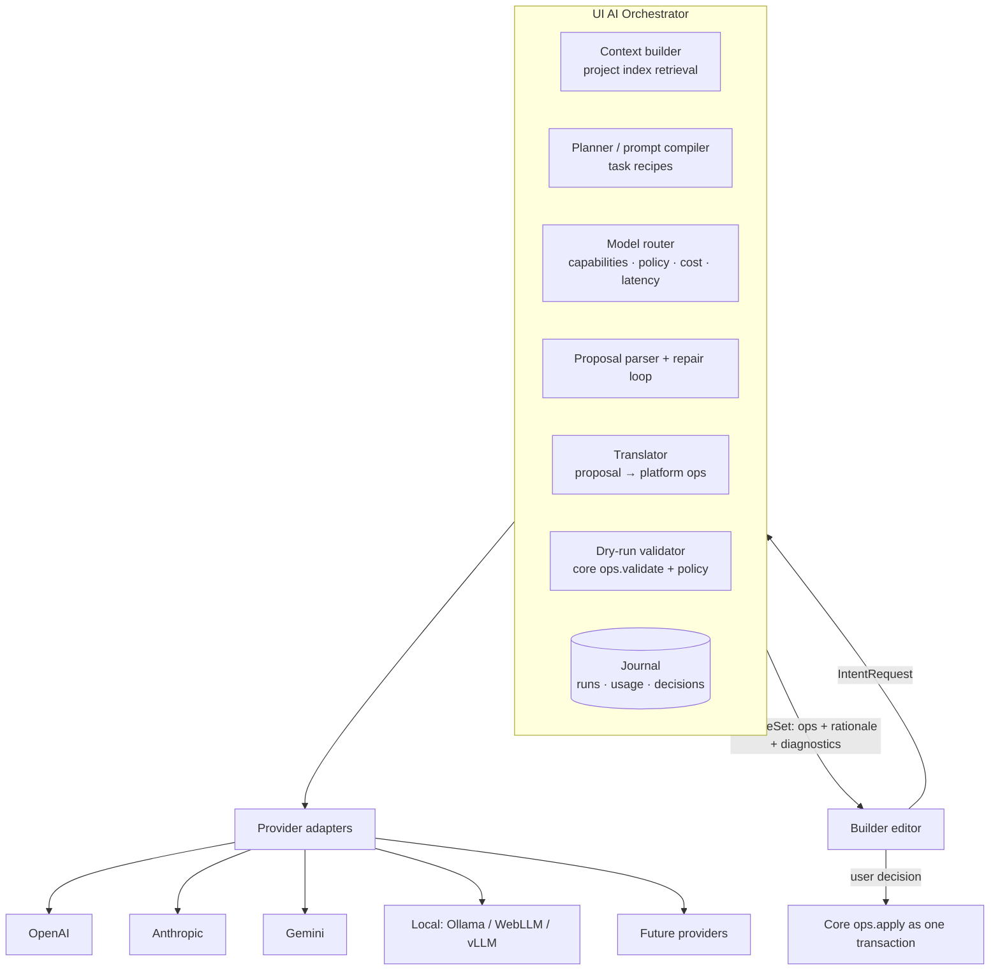
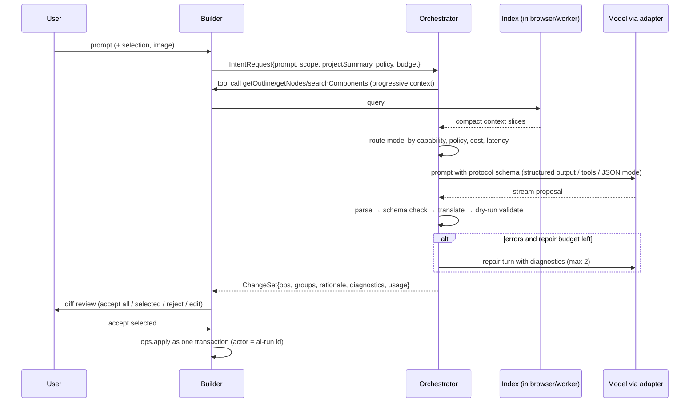

# 05 · UI AI Orchestrator architecture (Workstreams 4 and 6)

## Position



**Invariant:** providers return *text/JSON*. Only the Builder applies ops, only after validation *and* user approval. The orchestrator has no write access to project storage. (Switchboard invariants 3 and 5 applied here: every invocation has a policy decision, and untrusted content never triggers a side effect without approval.)

## Relationship to Switchboard and to existing `src/ai`

- **Adopt from Switchboard** (`../Switchboard/docs/project-index.md`): capability-based routing with deterministic ranking, `Allow/Deny/RequireApproval` policy decisions, content-trust taint, an append-only journal as the audit trail, "no vendor names in core logic" enforced by tests.
- **Don't depend on Switchboard in V1.** It is a .NET service; FrameWright's orchestrator must run inside the browser (local models, zero-cost stage) and in a TS edge function. Later, Switchboard can be plugged in as *one provider adapter* (`switchboard://…`) for enterprises who already run it. → [ADR-0007](adr/0007-ui-ai-orchestrator-boundary.md)
- **Existing `src/ai`** becomes the first local adapter (`webllm`) plus reusable pieces (NLP match → retrieval ranking; vision caption → a vision capability). `ComponentSpecSchema` is superseded by the op protocol.

## Protocol (model-independent)

Two levels, both versioned JSON Schemas generated from zod:

1. **Intent ops** – what the model produces. Coarse, forgiving, semantic, referencing nodes by id *or* by temporary refs.
2. **Core ops** – what the core applies ([11](11-project-ir.md#operations)). Fine-grained, strict. The translator compiles intent ops into core ops deterministically.

Keeping them separate lets us change prompts/models without touching the core, and change the core without retraining prompts.

### Envelope

```jsonc
{
  "protocol": "fw.intent/1",
  "summary": "Customer onboarding page with personal details, address and KYC",
  "assumptions": ["Using existing theme tokens", "KYC uses core.file-upload since no KYC component is installed"],
  "questions": [],                       // model may ask instead of guessing
  "operations": [ /* intent ops, in order */ ]
}
```

### Intent operations

| Op | Shape (abridged) | Compiles to core ops |
|---|---|---|
| `createPage` | `{ ref, name, path, template? }` | `page.create` + `route.set` |
| `createRoute` | `{ pageRef, path, guards? }` | `route.set` |
| `createLayout` | `{ parent, index?, tree: Node }` where `Node = { ref?, component, props?, slots?: {name: Node[]}, children?: Node[] }` | many `node.insert` |
| `addComponent` | `{ ref?, parent, index?, component, props? }` | `node.insert` |
| `moveComponent` | `{ node, parent, index? }` | `node.move` |
| `removeComponent` | `{ node }` | `node.remove` |
| `updateProps` | `{ node, set?: {}, unset?: [] }` | `node.setProp`× |
| `bindData` | `{ node, prop, source: { state \| resource \| event, path } }` | `node.setBinding` (+ `state.declare`) |
| `createAction` | `{ ref, name, steps: Step[] }` (steps = setState/request/navigate/validate/callHandler) | `logic.action.set` |
| `createRule` | `{ ref, when: Expr, then: { show \| hide \| enable \| disable \| setState } , target }` | `logic.rule.set` |
| `addValidation` | `{ field: nodeRef, rules: [{ rule, value?, message? }], group? }` | `logic.validation.set` |
| `applyTheme` | `{ tokens?: {name: value}, mode?, scope? }` | `theme.token.set`× |
| `createWorkflow` | `{ ref, trigger, steps, onError? }` | `logic.workflow.set` (P2) |
| `createDataSource` | `{ ref, kind: "http", url, method, … }` | `logic.resource.set` → **always RequireApproval** (egress) |

References: `"node": "#form1"` refers to a ref created earlier in the same proposal; `"node": "n_8Hk2"` refers to an existing node id from the context. The translator resolves refs to fresh deterministic ids (`createDeterministicId` in `src/ai/guards/validate.ts` is the seed of this).

### Example: "Create a customer onboarding page with personal details, address, and KYC verification."

```jsonc
{ "protocol": "fw.intent/1", "summary": "Onboarding page with three sections and a submit flow",
  "operations": [
    { "op": "createPage", "ref": "#onb", "name": "Customer onboarding", "path": "/onboarding" },
    { "op": "createLayout", "parent": "#onb", "tree":
      { "component": "core.form", "ref": "#form", "children": [
        { "component": "core.heading", "props": { "text": "Personal details", "level": 2 } },
        { "component": "core.input", "ref": "#name", "props": { "label": "Full name", "name": "fullName" } },
        { "component": "core.input", "ref": "#dob",  "props": { "label": "Date of birth", "name": "dob", "type": "date" } },
        { "component": "core.heading", "props": { "text": "Address", "level": 2 } },
        { "component": "core.input", "props": { "label": "Street", "name": "address.street" } },
        { "component": "core.heading", "props": { "text": "KYC verification", "level": 2 } },
        { "component": "core.file-upload", "ref": "#kyc", "props": { "label": "Government ID" } },
        { "component": "core.button", "ref": "#submit", "props": { "text": "Submit", "type": "submit" } } ] } },
    { "op": "addValidation", "field": "#name", "rules": [{ "rule": "required" }] },
    { "op": "addValidation", "field": "#kyc",  "rules": [{ "rule": "required", "message": "Upload an ID" }] },
    { "op": "createAction", "ref": "#submitFlow", "name": "submitOnboarding",
      "steps": [{ "validate": "default" }, { "navigate": "#thanks" }] },
    { "op": "bindData", "node": "#submit", "prop": "events.click", "source": { "action": "#submitFlow" } }
  ] }
```

The orchestrator notices `#thanks` doesn't exist → diagnostic → either a repair turn or a `questions` item for the user. It never invents a component: `core.file-upload` must be in the project's installed registry or it is rejected (see [06](06-ai-guardrails.md)).

## Pipeline



Context is **pulled**, not pushed: the orchestrator starts from a small project summary and asks for more via read-only tools. The index lives with the document (browser/worker in stage 1, server in stage 2), so the orchestrator never needs the whole project. See [13](13-scalability.md#ai-context-indexing).

## Provider adapter contract

```ts
export interface IAIProvider {
  readonly id: string;                         // "openai", "anthropic", "ollama-local"… metadata only
  listModels(): Promise<ModelDescriptor[]>;    // discovered, then merged with operator overrides
  getCapabilities(model: string): ModelCapabilities;
  generate(req: GenerateRequest, signal: AbortSignal): Promise<GenerateResult>;
  stream(req: GenerateRequest, signal: AbortSignal): AsyncIterable<StreamEvent>;
  estimateCost(req: GenerateRequest, model: string): CostEstimate;   // pre-flight
  health(): Promise<HealthStatus>;
}

export interface ModelCapabilities {
  structuredOutput: 'json-schema' | 'json-mode' | 'none';
  tools: 'parallel' | 'single' | 'none';
  vision: boolean; streaming: boolean;
  contextWindow: number; maxOutputTokens: number;
  locality: 'local-device' | 'self-hosted' | 'cloud';
  dataPolicy: { retention: 'none' | 'provider-default' | 'unknown'; region?: string };  // operator-asserted
  pricing?: { inputPerMTok: number; outputPerMTok: number; currency: 'USD' };            // operator-asserted
}

interface GenerateRequest {
  messages: Message[];                // provider-neutral roles, content parts (text, image, tool_result)
  tools?: ToolSpec[];                 // JSON Schema
  responseSchema?: JSONSchema;        // used if structuredOutput == 'json-schema'
  maxOutputTokens: number; temperature?: number; deadlineMs: number;
  metadata: { runId: string; orgId?: string };  // never user content
}
```

`supportsTools()/supportsVision()/supportsStructuredOutput()` from the brief are read from `getCapabilities()` so there is one source of truth. Each adapter maps neutral messages/tools to its wire format; nothing outside the adapter knows the vendor's API shape.

**Capability negotiation (degradation ladder):** `json-schema` structured output → tools with schema-typed arguments → JSON mode + schema in prompt → free text with fenced JSON extraction + repair. The same proposal schema is used on every rung, so model quality changes the *success rate*, never the *safety* of what can be applied.

## Registries, routing and fallback

- **Provider registry**: configured adapters + credentials reference (BYO key, org key, platform key, local).
- **Model registry**: discovered models ⊕ operator overrides (capabilities, price, data policy, allowed tasks). Governance comes from operator assertions, not model self-description (Switchboard invariant 2).
- **Task recipes**: `generate-page`, `edit-selection`, `explain`, `fix-validation`, `image-to-layout` — each declares required capabilities (e.g. `image-to-layout` requires `vision`), token budget, and a quality tier.
- **Router** (deterministic for identical inputs): hard filters (capability, policy: e.g. "no cloud models for org X", data region, budget) → soft scoring (quality tier, estimated cost, observed p95 latency, error rate) → ranked list. Fallback walks the list on timeout, 5xx, rate limit, or schema failure after repairs. Non-idempotent side effects don't exist here (providers only return text), so retries are safe.
- **Local-model support**: WebLLM in browser (exists), Ollama/vLLM/LM Studio via OpenAI-compatible HTTP adapter. Local models are the default in stage 1 when present.

## Observability and usage

Every run appends to the journal: `run.started` (task, model candidates, policy decisions), `provider.call` (model, tokens in/out, latency, cost estimate vs actual, finish reason), `proposal.parsed`, `validation.result`, `changeset.presented`, `changeset.decision` (accepted op ids). OpenTelemetry spans with GenAI semantic-convention attributes, names isolated in one module (Switchboard ADR-0006 pattern). Prompts and outputs are stored only if the org's policy allows it, and redacted at display time, not in state.

## Deployment modes

| Mode | Where | When |
|---|---|---|
| In-browser | Web worker; local models or BYO key the user pastes (kept in memory/session, never synced) | Stage 1, privacy-sensitive users |
| Edge function | Stateless TS (same code) with platform/org keys in a secret store; SSE streaming | Stage 1 optional, stage 2 default |
| Service | Dedicated container with job queue for long/batch runs and per-org rate limits | Stage 3 |

BA view: stories under epic **E5** in [17](17-epics-and-stories.md); guardrails in [06](06-ai-guardrails.md); threats in [12](12-security-threat-model.md).
