# 06 · AI guardrail architecture (Workstream 5)

## Principle

Guardrails are **boundaries first, validation second**. The model has no tool that writes; its output is inert data; the only path to state is the same `ops.apply` humans use, gated by a person. Validation then narrows what can even be *proposed*.

## Layered pipeline

```mermaid
flowchart LR
  subgraph Pre[Before the model]
    A1[Authn/Authz<br/>may this user use AI on this project?]
    A2[Budget check<br/>org/user/run tokens & cost]
    A3[Context assembly<br/>least data · secrets stripped · untrusted content fenced]
  end
  subgraph Call[Model call]
    B1[Timeout / deadline]
    B2[Max output tokens]
    B3[Structured output schema]
  end
  subgraph Post[After the model]
    C1[Parse + JSON Schema]
    C2[Registry check<br/>installed components · allowed props · enums]
    C3[Referential check<br/>refs · ids · routes · actions · resources]
    C4[Policy check<br/>restricted ops · egress · roles · size limits]
    C5[Security lint<br/>URLs · scripts · CSS injection · PII]
    C6[Dry-run apply on a copy<br/>core ops.validate + invariants]
  end
  subgraph Human[Approval]
    D1[Diff review UI]
    D2[Accept all / selected / reject / edit]
  end
  subgraph Commit
    E1[Apply as one transaction<br/>actor = ai-run]
    E2[Auto checkpoint version]
    E3[Audit journal]
  end
  Pre --> Call --> Post --> Human --> Commit
```



Each layer can **reject**, **repair** (send diagnostics back to the model, max 2 turns), or **escalate** (mark an op `requiresExplicitApproval`).

## Guardrail catalogue

| Guardrail | Mechanism | Where enforced |
|---|---|---|
| Schema validation | zod → JSON Schema for intent protocol and core ops; `additionalProperties: false` | Orchestrator *and* core (core re-validates everything; it doesn't trust the orchestrator either) |
| Allowed component registry | Only components installed in the project's lockfile at a tier the actor may use; AI may not install components | Core `registry.resolve` |
| Allowed props | Manifest `props` JSON Schema; unknown props rejected; enums enforced; string limits | Core |
| Permission checks | Actor = user ∩ AI policy. AI runs with **the requesting user's permissions minus restricted ops** — never more | Core policy |
| Restricted operations | Default-deny for AI: creating `custom` handlers, installing components, editing permissions/roles, secrets, environments, deployment config, deleting pages, changing data-source URLs. Configurable per org to `RequireApproval` (highlighted) or `Deny` | Policy |
| Dependency validation | Component deps & compatibility ranges; action → resource → validation group references (extends checks already in `parseProject`) | Core |
| Project policy validation | Org/project rules: e.g. "forms must have labels", "only tokens for colours", "max nesting 20", accessibility lints | Policy + lint |
| Security checks | URL scheme allowlist (`safeURL` exists), no `on*`/`dangerouslySetInnerHTML`/`srcDoc` props (already stripped in `Runtime.jsx`, now rejected at validation), CSS value filters (`resolveToken` rules), egress allowlist for resources | Core |
| Token/cost limits | Pre-flight `estimateCost`; per-run cap; per-user/day and per-org/month budgets; hard stop | Orchestrator |
| Model timeouts | Deadline per call + total run deadline; abort signals propagate to adapters | Orchestrator |
| Output size | Max ops per ChangeSet (default 500), max tree depth added (10), max new pages (10) | Orchestrator + core |
| Prompt-injection protection | See below | Orchestrator |
| Rollback | Accepted ChangeSet = one undo step; plus auto version checkpoint before apply; "revert AI run X" = apply its stored inverse (with conflict check) | Core |
| Versioning | Protocol version in every envelope; old intents re-translated or rejected, never guessed | Orchestrator |
| Audit | Journal: prompt hash, model, policy decisions, proposal, diagnostics, accepted/rejected op ids, actor, timestamps | Orchestrator + core |
| Approval + diff preview | Mandatory; no "auto-apply" setting for AI in V1. (P2 may allow auto-apply for *cosmetic-only* op classes per org policy, still journaled) | Editor |

## Prompt-injection protection

The threat: text inside the project (labels, imported JSON, API sample responses, component docs from the marketplace, uploaded images) contains instructions that steer the model.

1. **Capability containment (the real defence).** The model can only propose ops; ops are validated and human-approved; restricted ops are denied. Injection can at worst produce a bad *proposal*.
2. **Provenance/taint.** Context slices are tagged `trusted` (manifests from T0/T1, platform instructions) or `untrusted` (user content, T2/T3 docs, API data). Untrusted slices are placed in delimited data blocks with an instruction that they are data. If any untrusted slice was used, ops that cause **egress or privilege** (new resources, URLs, navigation to external links) are forced to `RequireApproval` with a warning badge (Switchboard's taint rule).
3. **Least context.** Only the slices needed (outline + selected nodes); no secrets ever (secrets are references — [ADR-0014](adr/0014-secrets-by-reference.md)); no other projects' data.
4. **Output-side checks** don't rely on the model obeying anything.

## Review UI ("code review for UI")

```
AI proposes  ·  "Customer onboarding page"                    model: local/qwen · 3.1k tok · $0.00
┌──────────────────────────────────────────────────────────────────────────────┐
│ [x] + Page "Customer onboarding"  /onboarding                                 │
│ [x]   + Form                                                                  │
│ [x]     + Section "Personal details"  (Heading, Full name, Date of birth)     │
│ [x]     + Section "Address"           (Street)                                │
│ [ ]     + Section "KYC verification"  (File upload)  ⚠ uses core.file-upload  │
│ [x]     + Button "Submit"                                                     │
│ [x]   + Validation: Full name required                                        │
│ [ ]   + Validation: Government ID required   ← depends on "KYC verification"  │
│ [x]   + Action "submitOnboarding": validate → navigate /thanks  ⚠ /thanks missing │
└──────────────────────────────────────────────────────────────────────────────┘
 [Accept all]  [Accept selected]  [Edit before applying]  [Reject]   Ask a follow-up…
```

- Ops are **grouped** semantically by the translator (one group per intent op, children nested). Checkboxes operate on groups.
- **Dependency closure**: unticking a group unticks its dependents (and shows why); ticking a dependent ticks its prerequisites. Computed from op references, so it's exact.
- The canvas shows a **ghost preview** of the ChangeSet (green = added, amber = changed, red = removed) before acceptance; toggling groups updates the ghost.
- **Edit** opens the proposal as a draft branch of the document: the user edits normally, then accepts. Internally it's the same ChangeSet plus human ops, still one transaction.
- Diagnostics (warnings) are attached to groups, not hidden in a log.

## Rollback semantics

- Accepted ChangeSet → one history entry `AI: <summary>` with inverse ops.
- If later human edits touch the same nodes, "Revert AI run" computes inverses against current state; ops whose targets changed are listed as conflicts for the user instead of being silently skipped.

## Why AI can never bypass this

- The orchestrator holds **no write credentials**; the project API accepts ops only from authenticated editor sessions with a user actor, and ops tagged `actor.kind = "ai"` must carry an approval token issued by the editor when the user pressed Accept (server re-validates it in stage 2).
- The core re-validates every op regardless of source.
- Architecture test: no module under `src/orchestrator/**` may import `ops.apply` or persistence modules.

Stories: epic **E6** in [17](17-epics-and-stories.md). Threats: [12](12-security-threat-model.md#ai-specific-threats).
