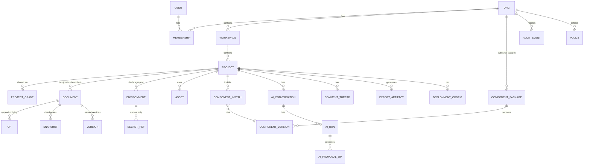

# 07 · Data architecture (Workstream 2)

## Storage placement

| Data | Store | Why |
|---|---|---|
| Users, orgs, memberships, roles, projects, environments, component packages/versions, installs, AI runs metadata, billing | **Postgres** (relational) | Integrity, joins, RLS, transactions |
| Project document **op log** (append-only, per document, server sequence) | **Postgres** table (partitioned by month later) | Needed transactionally with authz; is the event store |
| Document **snapshots** (full IR JSON every N ops / on version) | **Object storage** (compressed), pointer in Postgres | Large, immutable, cheap |
| Named versions / branches | Postgres rows → snapshot pointers | |
| Assets (images, fonts), exports (ZIP), component bundles, thumbnails | **Object storage** + CDN | Large binaries, immutable, cacheable |
| Audit log | Postgres append-only table (`audit_events`), exported to cold object storage | Compliance queries, retention |
| Sessions, rate-limit counters, presence, doc hot state | **Cache/KV** (Redis/Valkey, or edge KV / Durable Object memory) | Ephemeral, high-churn |
| Search (projects, components, pages by name/text) | Postgres full-text + `pg_trgm` first → OpenSearch/Meilisearch at stage 3 | Avoid extra infra early |
| AI context embeddings (optional, P2) | `pgvector` | Same DB, RLS applies |
| Background jobs | Postgres-backed queue (graphile-worker / pg-boss) → managed queue at stage 3 | One fewer system early |

In **stage 1** (local-first), the same logical model lives in the browser: IndexedDB stores `{ document snapshot, op log since snapshot, versions }` per project; JSON export is the backup. The local model is a subset of the server schema so sync in stage 2 is "upload the op log".

## Entity model (initial)



**Where do pages, component instances, themes, tokens, data sources, actions, rules, workflows live?** Inside the **document** (the Project IR), not as relational rows. They change together, are versioned together, must export/import as one unit, and are edited by ops at high frequency. Relational rows for them would make versioning, branching, export and collaboration much harder. The server keeps **derived, read-only projections** where queries need them (e.g. `project_index` with page names, component usage counts for "where is `acme.kyc-upload@2` used?") updated from the op log.

### Key tables (sketch)

```sql
create table orgs (id uuid pk, slug citext unique, name text, plan text, region text, created_at timestamptz, deleted_at timestamptz);
create table users (id uuid pk, email citext unique, name text, created_at timestamptz, deleted_at timestamptz);
create table memberships (org_id uuid, user_id uuid, role text check (role in ('owner','admin','member','guest')), primary key (org_id,user_id));
create table projects (id uuid pk, org_id uuid not null, workspace_id uuid, name text, owner_id uuid, visibility text, ir_schema_version int, created_at timestamptz, deleted_at timestamptz);
create table project_grants (project_id uuid, principal_type text, principal_id uuid, role text check (role in ('owner','editor','commenter','viewer')), primary key (project_id, principal_type, principal_id));
create table documents (id uuid pk, org_id uuid, project_id uuid, branch text default 'main', head_seq bigint, base_snapshot_id uuid);
create table ops (org_id uuid, document_id uuid, seq bigint, actor_type text, actor_id text, client_id text, client_op_id text, tx_id uuid, op jsonb, created_at timestamptz, primary key (document_id, seq), unique (document_id, client_id, client_op_id));
create table snapshots (id uuid pk, org_id uuid, document_id uuid, seq bigint, object_key text, sha256 text, ir_schema_version int, created_at timestamptz);
create table versions (id uuid pk, org_id uuid, document_id uuid, seq bigint, snapshot_id uuid, label text, created_by uuid, created_at timestamptz);
create table audit_events (id bigserial, org_id uuid, at timestamptz, actor_type text, actor_id text, action text, resource_type text, resource_id text, ip inet, details jsonb);
create table ai_runs (id uuid pk, org_id uuid, project_id uuid, user_id uuid, task text, model_ref text, status text, tokens_in int, tokens_out int, cost_micros bigint, proposal_object_key text, decision jsonb, created_at timestamptz);
```

Every tenant-owned table carries `org_id` (denormalised on purpose) for RLS and future sharding.

## Multi-tenancy

- **Model**: shared database, shared schema, `org_id` on every row; **Postgres Row-Level Security** as defence in depth under application authorisation (`set_config('app.org_id', …)` per request transaction). → [ADR-0010](adr/0010-tenancy-shared-schema-rls.md)
- **Why not schema/DB per tenant now**: operational cost, migrations × N, connection counts. **Migration path**: `org_id` everywhere means an org can be moved to a dedicated database or regional **cell** (stage 3) with a copy + op-log catch-up; object storage keys are prefixed `org/<id>/…` for the same reason.
- **Tenant isolation for code**: component bundles and user content are served from the sandbox origin, never the app origin ([04](04-component-plugin-architecture.md)).

## RBAC and sharing

- Org roles: `owner, admin, member, guest`. Project roles: `owner, editor, commenter, viewer`. Effective permission = max(project grant, org default for workspace) bounded by org role (guests only via explicit grants).
- One `authorize(actor, action, resource)` function in the API with a permission matrix in code and tests; the same matrix is exported to the editor to hide UI (UI hiding is never the check).
- **Actor kinds**: `user`, `ai-run` (acts *on behalf of* a user, bounded by user ∩ AI policy), `plugin` (bounded by granted permissions), `system`.
- Sharing: invite by email → grant; link sharing (viewer/commenter) with optional expiry; transfer ownership = owner change + audit.
- Later (P2+): relationship-based authz (OpenFGA/SpiceDB) if nested folders/teams make the matrix unwieldy.

## Versioning, history, soft delete

- **History = op log.** Undo is client-side (inverse ops); server history lets users browse any `seq`, restore a version (a new op batch that sets state, not a rewrite), or branch (new document with `base_snapshot_id`).
- Named versions are cheap pointers. Auto versions: on AI ChangeSet apply, on import, daily.
- **Soft delete** with `deleted_at` on orgs/projects/users; purge job after 30 days (configurable); hard delete for GDPR erasure runs through a job that also deletes object-storage prefixes and scrubs actor ids in audit (pseudonymise, keep the event).
- Op-log compaction: keep full ops for N days (plan-based), then collapse to snapshots + versions.

## Import/export, portability, backups

- **Export** = the portable IR JSON (already exists as `format: "framewright"`), plus an `assets/` folder in a ZIP; optionally the op log for full history.
- **Import** validates with the same parser (`parseProject` → v2 parser), runs migrations, re-keys ids on collision, and lands as a new version (existing "undo last import" behaviour generalises to "restore previous version").
- **Backups**: managed Postgres PITR (stage 2), nightly logical dumps to a different provider's object storage (stage 2+), object storage versioning/replication. Restore drills quarterly ([08](08-deployment-architecture.md)).

## Schema evolution

- IR: `schemaVersion` integer; **migrators are pure functions** `vN → vN+1`, chained; golden files for every version in `docs/schema/fixtures/`; the server stores `ir_schema_version` per snapshot and upgrades lazily on read, eagerly by background job.
- Ops: versioned per op type (`node.insert@1`); the server rejects unknown versions from old clients with "please reload".
- Component contracts: manifest `migrations` (declarative) — [04](04-component-plugin-architecture.md).
- DB: forward-only SQL migrations (expand → migrate → contract), no destructive change in the same release as the code that stops using a column.

## AI data

- `ai_conversations` / `ai_runs` store metadata always; prompts/proposals stored in object storage **only if org policy allows**, with retention; decisions (accepted op ids) always, because they're audit.
- Generated artefacts (exports, images) → object storage with `generated_by` provenance.

Stories: epic **E8** and **E9** in [17](17-epics-and-stories.md).
