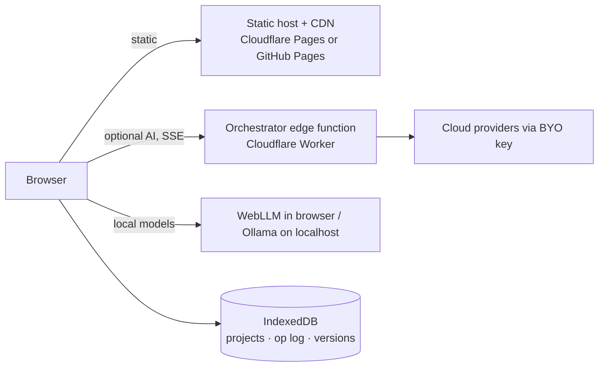
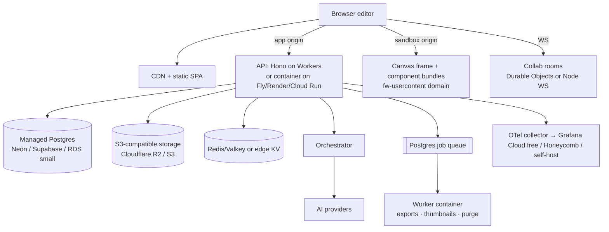
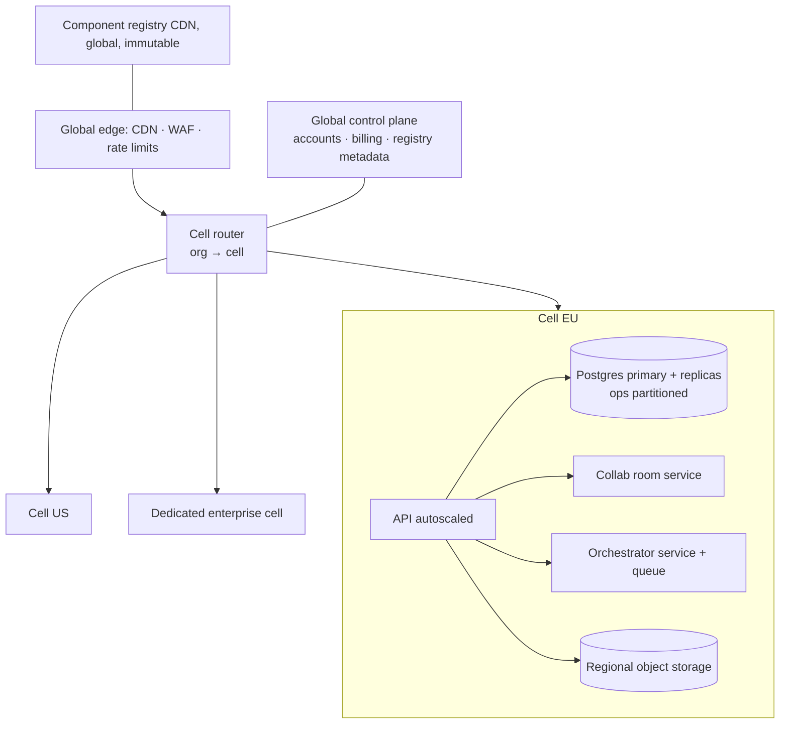

# 08 · Deployment and production architecture (Workstream 1)

> Vendor limits and prices below are indicative (knowledge to mid-2026) and must be re-checked before committing (spike **S-12**). The architecture is chosen so each vendor is replaceable by a standard: **static hosting, a portable TypeScript HTTP app, Postgres, S3-compatible storage, OIDC**.

## Portability rules (what prevents dead ends)

1. API code is **Hono on web-standard `Request/Response`** so the same app runs on Cloudflare Workers, Node, Bun, Deno or a container. No platform-only APIs in business logic; platform bindings live in one adapter module. → [ADR-0013](adr/0013-portable-typescript-api-edge-first.md)
2. Data is **plain Postgres** (no proprietary extensions beyond widely available ones: `pgcrypto`, `pg_trgm`, `pgvector`).
3. Files via the **S3 API**.
4. Auth via **OIDC/OAuth2** with users stored in our own Postgres (library, not a hosted identity silo), so switching IdP or adding SAML is additive.
5. Infra as code (Terraform/OpenTofu or the platform's config files in git) from stage 2.

## Stage 1 · Free / hobby (target: $0–10/month)

| Concern | Choice | Why | Limits | Scaling trigger | Migration path |
|---|---|---|---|---|---|
| Frontend hosting | Cloudflare Pages (alt: GitHub Pages, Netlify, Vercel hobby) | Free, global CDN, preview deploys per branch | Build minutes/month; commercial-use rules on some hobby tiers | Needs custom headers/CSP per path → already supported by Pages `_headers` | Any static host/S3+CDN |
| Backend/API | None. Optional stateless orchestrator Worker | Local-first means no server state to host | Worker CPU-time limits on free tier; SSE streaming fine | Need accounts/sync | Add API Worker (stage 2) |
| Database | IndexedDB in browser | Free, private, offline | Per-device, can be evicted; no sharing | First user asks to share or sync | Upload op logs to Postgres |
| Object storage | None (assets as data URLs/Blobs in IndexedDB, capped) | | Size limits | Assets > few MB | R2/S3 |
| CDN | Included with static host | | | | |
| Auth | None | Single user | | Cloud save | OIDC (stage 2) |
| Caching | HTTP cache headers, hashed assets | | | | |
| Queues/jobs | None: export ZIP built in browser (JSZip already used) | | | Server-side builds | Postgres queue |
| Logging/observability | Browser error reporting (Sentry free tier or self-hosted GlitchTip), privacy-respecting analytics opt-in | | Event quotas | | OTel |
| Rate limiting | Worker: per-IP limit via platform rate-limit binding; BYO key means user pays | | | Platform keys | Per-user limits in KV |
| Secrets | Worker secrets for any platform key; BYO keys stay in the browser session | | | | Secret manager |
| CI/CD | GitHub Actions: lint, test, build, deploy preview | Free for public / generous for private | Minutes | | Same |
| Backups/DR | User-driven JSON export; optional "export reminder" | | Users forget | Cloud save | PITR |
| Multi-region | Implicit via CDN | | | | |
| Tenant isolation | N/A (single user, local) — but sandbox origin set up for canvas when T1 components arrive | | | | |
| Cost controls | No platform AI keys by default; local models or BYO key | | | | Budgets |

## Stage 2 · Early production (hundreds–low thousands of users; target: <$100/month infra excluding AI)

| Concern | Choice | Why | Limits | Scaling trigger | Migration |
|---|---|---|---|---|---|
| API hosting | Hono on Cloudflare Workers (DB via Hyperdrive/serverless driver) **or** one small container (Fly.io/Render/Cloud Run) | Same code either way; Workers = no idle cost; container = simplest Postgres pooling | Workers CPU limits for heavy jobs → those go to the job worker | p95 latency, CPU limits, need for long connections | Container autoscaling group / Kubernetes (stage 3) |
| Database | Managed Postgres with PITR (Neon, Supabase, or RDS/Cloud SQL) | Relational + JSONB + RLS + pgvector | Free tiers pause/suspend or cap storage; move to paid (~$20–30/mo) for real users | Storage > few GB, connections, CPU | Bigger instance → read replicas → partition `ops` → cells |
| Object storage | Cloudflare R2 (zero egress) or S3 | S3 API | | | Any S3 |
| CDN | Cloudflare | | | | |
| Auth | Better Auth / Auth.js-style library storing users in our Postgres; Google/GitHub/email magic link; passkeys | No per-MAU fees, no identity lock-in | We own security of auth flows (use a maintained library, never hand-roll) | Enterprise SSO demand | Add SAML/OIDC enterprise connections (library or WorkOS-like broker, stage 3) |
| Caching | HTTP caching; KV for sessions/rate limits; in-memory LRU in API | | | | Redis cluster |
| Queues | Postgres-backed (graphile-worker/pg-boss) in one worker container | One less system | Throughput ~ hundreds jobs/s is plenty | Sustained backlog | SQS/Cloud Tasks/Cloudflare Queues |
| Observability | OpenTelemetry SDK → hosted free tier (Grafana Cloud/Honeycomb) + Sentry | Standard protocol, swap backends | Free-tier retention | Volume | Paid tier or self-host |
| Rate limiting | Per user/org/IP token buckets in KV; stricter on AI and auth endpoints | | | | Edge WAF rules |
| Secrets | Platform secret store (Workers secrets / Fly secrets / GCP Secret Manager); project secrets encrypted with envelope encryption (KMS or libsodium with a master key in the secret store) | | | Enterprise BYOK | KMS per org |
| CI/CD | GitHub Actions: test → build → migrate (expand) → deploy canary → smoke → promote | | | | Same + progressive delivery |
| Backups/DR | PITR (7 days), nightly `pg_dump` to *another* provider's bucket, R2 → S3 replication for snapshots; RPO ≤ 24h (≤ 5 min with PITR), RTO ≤ 4h; quarterly restore drill | | | | Cross-region replica |
| Multi-region | Single primary region close to users; static + edge globally | Simplicity | Latency for far users on writes | Customers need residency | Stage 3 cells |
| Tenant isolation | App authz + RLS; storage prefixes per org; sandbox origin for user code | | | | Cells / dedicated DB |
| Cost controls | Budget alerts; AI budgets per org; plan limits (projects, AI credits, storage) | | | | FinOps dashboards |

## Stage 3 · Large-scale SaaS

- **Cells**: an org lives in one cell (region/residency, blast-radius limits, noisy-neighbour isolation). Enabled by `org_id` everywhere and org-prefixed storage from stage 2.
- **Postgres scale**: partition `ops` by time and document hash; move audit to a columnar store (ClickHouse/BigQuery) with object-storage archive; read replicas for projections/search; OpenSearch for search.
- **Collab**: room service sharded by document id (Durable Objects or a Node/Go service behind consistent hashing).
- **Orchestrator**: separate autoscaled service with per-org concurrency and budgets; provider circuit breakers; optional private model endpoints per enterprise.
- **Compliance**: SSO/SCIM, audit export, data residency per cell, customer-managed keys, SOC 2 controls.
- **DR**: cross-region replicas per cell, documented failover; RPO minutes, RTO < 1h.

## Environments

`local` (Vite + optional Docker Postgres/MinIO) · `preview` (per PR, ephemeral DB branch where the provider supports it) · `staging` · `production`. Seed data and example projects come from `examples/`.

Cost detail per stage: [14](14-cost-model.md). Stories: epic **E10** in [17](17-epics-and-stories.md).
