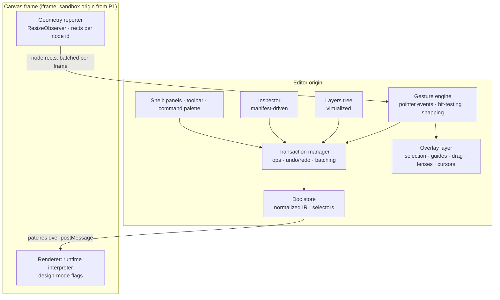

# 09 · Editor and canvas architecture (Workstreams 7 and 8)

## Part A · Why people prefer Figma (interaction principles, not features)

| Principle | What Figma does | Why it matters | Adopt? | How it maps to an app builder |
|---|---|---|---|---|
| **Direct manipulation, zero mode friction** | Click, drag, resize anything; properties update live | Feedback loop < 100 ms builds flow | **Yes** | Real components, but gestures must feel instant: overlay-driven drag, optimistic ops |
| **Spatial canvas** | Infinite canvas with many frames side by side | See flows, states, breakpoints at once | **Yes** | Frames = pages × breakpoints × states (empty/loading/error) on one canvas |
| **Everything is a frame; auto-layout** | Frames nest; auto-layout = stack with gap/padding/alignment/hug/fill | Layout that survives content changes | **Yes, as the default** | Auto-layout *is* CSS flexbox (plus grid). Our layout props map 1:1 to CSS, so output is maintainable. Absolute positioning is opt-in per node. |
| **Constraints & responsive** | Pin/scale relative to parent | Resizing frames reflows content | **Adapt** | Use CSS semantics: min/max width, fill/hug/fixed, breakpoint overrides — not Figma constraints |
| **Components, instances, overrides, variants** | Main component → instances with property overrides; variant matrix | Reuse without losing local tweaks | **Yes** | Maps to manifests (code components) *and* compositions (schema components). Overrides stored as prop deltas on instances. |
| **Design tokens / variables & modes** | Variables with modes (light/dark, brand) | Theming at scale | **Yes** | DTCG tokens exist (`src/runtime/theme.js`); add modes |
| **Context-sensitive inspector** | Right panel shows only what applies | Low cognitive load | **Yes** | Driven by manifest `props` + `editor.groups` |
| **Keyboard-first & discoverable** | Shortcuts for everything; quick actions (⌘/) | Experts fly; novices discover | **Yes** | Command palette over *ops* (`isCommandPaletteOpen` exists in the store) |
| **Smart selection** | Click-through nesting, ⌘-click deep select, Enter/Shift+Enter to go down/up, marquee | Nested trees are navigable | **Yes** | Same bindings on the node tree |
| **Smart guides, spacing, redlines** | Show distances, equal-spacing hints | Precision without numbers | **Adapt** | In flow layouts: show gap/padding handles and drag-to-adjust; alignment guides for absolute nodes only |
| **Non-destructive history + versions** | Undo, version history, branching | Safe exploration | **Yes** | Op-based undo + versions + branches ([07](07-data-architecture.md)) |
| **Multiplayer + comments** | Cursors, selections, comments pinned to nodes | Team flow | **Later (P1/P2)** | [10](10-collaboration.md) |
| **Vector drawing, boolean ops, pen tool** | Illustration | Not our job | **No** | Import SVG as asset/icon components |
| **Pixel-freeform first** | Absolute by default | Produces bad app code | **No** | Flow layout first |

**The differentiator Figma can't have**: the canvas understands semantics. Proposed **lenses** (toggleable overlays on the same canvas):
- *Data lens*: bound props show their source (`$state.user.name`, resource), unbound required inputs are flagged.
- *Logic lens*: event → action arrows, rules (`visibleWhen`) as badges, navigation arrows between frames.
- *Validation lens*: each field shows its rules; preview failing states inline.
- *Permissions lens*: which roles see which nodes.
- *A11y lens*: labels, contrast, tab order.

## Part B · Rendering technology for an application builder

| Criterion | DOM (real components) | HTML Canvas 2D | SVG | WebGL/WebGPU | **Hybrid: DOM content + overlay** |
|---|---|---|---|---|---|
| Component fidelity | **Exact** (it *is* the app) | Must re-implement every component's rendering → never exact | Poor for forms/text inputs | Same as canvas | **Exact** |
| Accessibility | Native | Needs parallel a11y tree | Partial | Needs parallel tree | Native for content; overlay is ARIA-labelled |
| Text editing | Native `contenteditable`/inputs | Custom text engine (huge effort) | Weak | Custom | Native |
| Nested/responsive layout | Browser layout engine = production layout | Re-implement flex/grid | Manual | Re-implement | Browser engine |
| React integration / plugins | Just render the component | Impossible for third-party React | Poor | Impossible | Just render the component |
| Drag/drop, handles, guides | Hard if done *inside* content DOM (event conflicts, layout shift) | Easy | Easy | Easy | **Easy — done in the overlay** |
| Zoom/pan | CSS `transform: scale` on viewport; text stays crisp mostly; very large zoom-outs get expensive | Great | Good | Great | Transform on content; overlay drawn in screen space |
| Performance at 10k nodes | Needs virtualization of off-screen frames, memoisation | Great | Degrades | Best | Content culling per frame + cheap overlay |
| Debugging | DevTools | Hard | OK | Hard | DevTools |

**Decision: hybrid — DOM rendering of real components inside frames, plus a separate overlay layer (DOM/SVG in screen coordinates) for selection, handles, guides, drop indicators, lenses and presence.** → [ADR-0004](adr/0004-dom-canvas-with-overlay.md)

Figma needs a custom renderer because its *output* is graphics. Ours is an application; the browser's layout engine is the only faithful renderer of it. Canvas/WebGL would be used only for things like a minimap or zoomed-out thumbnails (render frames to bitmaps when zoom < ~25%).

## Part C · Editor architecture

Key choices:

1. **One renderer** for canvas, preview and runtime export: the `src/runtime` interpreter, with a *design mode* (no navigation, no network unless allowed, events captured, placeholders for empty slots). Today Canvas/DroppableComponent render components separately from Runtime — this removes a whole class of "looks different in preview" bugs.
2. **Frame iframe** per canvas (not per node): CSS isolation from editor styles (Mantine), real viewport widths for breakpoints (media queries work), and later the security boundary for T1/T2 code. In P0 it can be same-origin; the host↔frame protocol (`render(patch)`, `reportGeometry`, `highlight`) is defined now.
3. **Gestures in the overlay, not in content**: replace react-dnd's HTML5 backend on the canvas with pointer-event gestures over the overlay; hit-testing uses geometry reported by the frame (node id → rect, plus layout direction of parents so the drop indicator knows "between which children"). HTML5 DnD can remain for palette → canvas if convenient, but moving/reordering/resizing is overlay-driven. This works across iframes and later across origins.
4. **Auto-layout editing**: gap/padding handles, alignment matrix, hug/fill/fixed sizing, wrap, grid tracks — each a single `node.setProp` on the layout props; breakpoint overrides stored as `props@md`-style responsive values in IR ([11](11-project-ir.md)).
5. **Selection model** in the editor store (exists: `selectedComponentIds`); add hover, focus-within-frame, and "entered group" state.
6. **Clipboard**: copy = serialize subtree to IR fragment JSON (+ `text/html` preview); paste = `node.insert` ops with id re-keying; cross-project paste resolves components against the target lockfile (missing → placeholder + prompt to install).
7. **Undo/redo**: transaction manager groups ops per gesture (drag = one entry); inverse ops; per-user stack (collaboration-ready). Replaces snapshot history in `PageContext.jsx`.
8. **Keyboard**: shortcut map is data (`utils/keyboard.ts` exists) bound to *commands* that produce ops; the command palette lists the same commands.
9. **Comments/presence/multiplayer** attach to node ids and render in the overlay ([10](10-collaboration.md)).
10. **Asset libraries**: assets panel over project + org libraries; components panel groups by package with versions and trust badges.

## BA view

- **Personas**: designer (speed, fidelity), developer (structure), BA (semantics).
- **Pain today**: drag/drop via nested droppables is fiddly; no multi-frame view; preview ≠ canvas rendering path; layout controls are CSS fields rather than auto-layout controls.
- **Dependencies**: IR v2 + ops (P0), unified registry (P0), frame protocol (P0), geometry reporter (P1).
- **Risks**: iframe geometry sync latency (spike S-02), text editing inside iframe (inline edit via overlay-positioned input or `contenteditable` in frame, spike S-03).
- Stories: epics **E4** and **E7** in [17](17-epics-and-stories.md).
