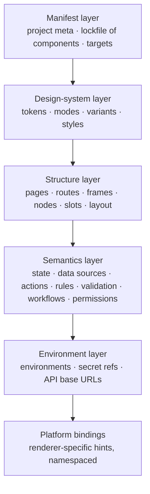
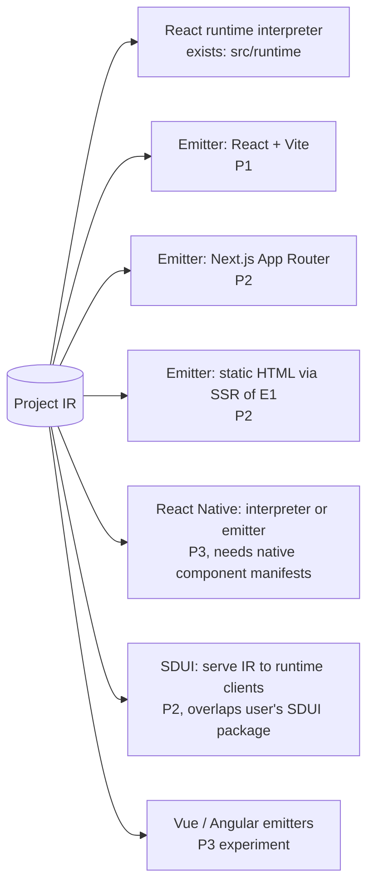

# 11 · Project IR proposal, renderers and export (Workstreams 11 and 12)

## Goals

1. Independent of React (and of the editor): an app *model*, not a component tree dump.
2. Deterministic: canonical serialisation, stable ids, ordered keys.
3. Evolves from today's `format: "framewright", schemaVersion: 1` without breaking any existing file.
4. Efficient to edit (normalized), easy to diff/sync (ops), easy to read/export (portable form).

## Layers of the IR



Rule: layers above **Platform bindings** may not contain renderer-specific concepts (no `className`, `onClick`, JSX, hooks). Events are named semantically (`click`, `submit`, `change`, `uploaded`), children live in named slots, styles are layout/style *props* with token references. Renderer hints go under `platform.react`, `platform.native`, etc., and are ignored by other renderers.

## IR v2 (portable form)

```jsonc
{
  "format": "framewright", "schemaVersion": 2,
  "project": { "id": "p_…", "name": "Onboarding", "targets": ["react-web"] },
  "components": { "core.button": "1.0.0", "core.form": "1.0.0", "acme.kyc-upload": "2.3.0" },   // lockfile
  "theme": { "name": "Acme", "modes": ["light", "dark"], "tokens": { "color.brand": { "type": "color", "value": { "light": "#2563eb", "dark": "#60a5fa" } } } },
  "state": { "user": { "type": "object", "default": {} } },            // app-level state schema
  "resources": { "createCustomer": { "kind": "http", "method": "POST", "url": "{env.API_BASE}/customers", "body": { "$state": "form" }, "auth": { "$secret": "API_TOKEN" } } },
  "pages": {
    "pg_home": { "name": "Contact", "path": "/", "root": "n_root", "logic": { "actions": {}, "effects": [], "validation": {}, "rules": [] } }
  },
  "nodes": {                                                             // normalized, flat
    "n_root": { "type": "core.container@1", "parent": null, "page": "pg_home", "props": { "layout": { "mode": "stack", "direction": "vertical", "gap": { "$token": "space.md" } } } },
    "n_h1":   { "type": "core.heading@1", "parent": "n_root", "slot": "children", "order": "a0", "props": { "text": "Build something lasting.", "level": 1 } },
    "n_btn":  { "type": "core.button@1", "parent": "n_root", "slot": "children", "order": "a1",
                "props": { "text": "Send", "width": { "base": "fill", "md": "hug" } },     // responsive values
                "events": { "click": ["submitContact"] }, "visibleWhen": { "$ne": [{ "$state": "sent" }, true] } }
  },
  "environments": { "dev": { "API_BASE": "http://localhost:3001" }, "prod": { "API_BASE": "https://api.example.com" } },
  "platform": { "react": { "router": "hash" } }
}
```

- `nodes` is a flat map keyed by id with `parent`, `slot`, `order` (fractional index). Children are derived. This single change enables O(1) lookup, granular subscriptions, conflict-free concurrent inserts, and trivial ops.
- Canonical serialisation: keys sorted, nodes sorted by id, no `undefined`, numbers normalised. Two equal documents serialise to identical bytes (tested).
- v1 files (nested `layout`, per-page `logic`, bare type ids like `button`, `contractVersion`) import via a pure `migrate1to2` → [ADR-0002](adr/0002-project-ir-normalized-document.md). `parseProject` (existing) stays the v1 validator; the v2 parser adds the same referential checks it already performs.
- The existing `logic` vocabulary (`setState`, `request`, `navigate`, `validate`, `custom`; `$state`/`$event`/`$token`/`$eq`…) is kept verbatim — it's already renderer-neutral and safe. New: `rules` (declarative show/hide/enable), `workflows` (P2), `permissions` (role → node visibility, P2), `$env` and `$secret` references.

## Operations

Core ops are the only mutation API ([ADR-0003](adr/0003-operations-single-mutation-path.md)). Each op is a small JSON object with a type and version; `apply(doc, op) → { doc, inverse }` is pure.

| Op | Payload | Inverse |
|---|---|---|
| `node.insert@1` | `{ id, type, parent, slot, order, props?, events?, … }` | `node.remove` |
| `node.remove@1` | `{ id }` (removes subtree; inverse stores subtree) | `node.insertTree` |
| `node.insertTree@1` | `{ nodes: [...] }` (paste, AI layouts) | `node.remove` |
| `node.move@1` | `{ id, parent, slot, order }` | `node.move` (old position) |
| `node.setProp@1` | `{ id, path, value }` (`path` like `layout.gap` or `width.md`) | `node.setProp` old / `node.unsetProp` |
| `node.unsetProp@1` | `{ id, path }` | `node.setProp` |
| `node.setBinding@1` / `node.setEvent@1` / `node.setVisibility@1` | … | previous value |
| `node.changeType@1` | `{ id, type, propMap }` (component swap/upgrade) | reverse |
| `page.create@1` / `page.remove@1` / `page.update@1` | … | … |
| `route.set@1` | `{ page, path }` | previous |
| `logic.state.set@1`, `logic.action.set@1`, `logic.resource.set@1`, `logic.effect.set@1`, `logic.validation.set@1`, `logic.rule.set@1` | keyed upserts with `null` = delete | previous |
| `theme.token.set@1` / `theme.mode.set@1` | … | previous |
| `components.install@1` / `components.upgrade@1` | lockfile edit (+ migration ops) | previous |
| `env.set@1` | non-secret env values, secret *names* | previous |

A **transaction** `{ txId, actor, label, ops[] }` is atomic: all ops validate against the evolving doc or none apply. Undo entry = reversed inverses. Every op is checked by: schema → registry (type installed, props valid) → structural invariants (parent exists, slot accepts type, no cycles, depth ≤ 60, unique routes) → policy (actor may perform). These are the *same* checks the AI dry-run uses.

## Renderers



Feasibility per target:
- **React/Next.js/static HTML**: direct — same components, routes map to files, SSR gives static HTML.
- **SDUI**: the IR *is* server-driven UI; the runtime interpreter is the client. This is effectively free and aligns with `../SDUI`; a spike (S-10) should decide whether `@ganesh/sdui-react` becomes the production runtime or stays separate.
- **React Native**: layout (flex) and semantics transfer; components don't. Requires manifests to declare `implementations: { "react-web": …, "react-native": … }`; nodes of components lacking a native implementation are flagged. Feasible for form/CRUD apps, not for arbitrary web components.
- **Vue/Angular**: emitters are possible because the IR has no React concepts; component libraries must exist per framework. Experimental.

V1 guard: only `react-web` is a supported target. The boundary that keeps others possible is the "no renderer concepts above platform bindings" rule, checked by a schema lint.

## Export

Two modes, same IR, both deterministic → [ADR-0012](adr/0012-dual-export-runtime-and-code.md).

### A. Runtime mode (exists: `configAppGenerator.js`)
Small React app + `@framewright/runtime` + `app.config.json`. Change the JSON, not the code. Best for teams that keep designing in FrameWright. Independent of the SaaS: the runtime is an npm package (MIT) or vendored source.

### B. Code mode ("eject")
Idiomatic source that a developer would write:

```
my-app/
  package.json            # pinned deps; only what's used
  .env.example            # VITE_API_BASE=…, secret names documented, no values
  src/
    main.tsx  App.tsx  routes.tsx          # react-router routes from pages
    pages/ContactPage.tsx                  # one file per page; component names from node names
    components/                            # compositions become local components
    state/store.ts                         # app/page state (Zustand or useReducer; configurable)
    api/client.ts  api/resources.ts        # typed fetch functions per resource
    validation/contact.schema.ts           # zod schemas from validation rules
    styles/tokens.css  pages/*.module.css  # tokens as CSS variables; styles as CSS modules
  tests/ContactPage.test.tsx               # smoke + validation tests generated from rules
```

- **Determinism**: stable ordering, names derived from node names with collision suffixes, Prettier formatting with pinned config, no timestamps; golden-file tests per example project.
- **Dependencies**: built-ins import from `@framewright/components` (published) *or* are vendored as source (option); T1 components import from their `source.npm` package; T3 blocks export (must be promoted).
- **Styles**: tokens → `tokens.css` variables (existing `--fw-*` scheme); per-node styles → CSS modules; responsive values → media queries.
- **Routes**: react-router (or Next.js file routes in E2); guards from permissions.
- **State/actions**: actions compile to plain async functions; effects to `useEffect` with the watched paths; `custom` handlers become typed stubs in `handlers.ts` (as runtime mode does today).
- **API calls**: resources compile to fetch functions reading `import.meta.env`; secrets never inlined — the exported app expects a backend or env for them.
- **Validation**: zod schemas; forms wired with a small hook.
- **Testing**: generated tests run in CI of the exported project; our pipeline builds every golden project on each change (the manual check done on 2026-09-28 becomes automated).
- **Round-trip**: code mode is one-way. Re-import of edited code is out of scope (P3 research: Plasmic-style "code components" instead).

Existing `codeGenerator.js` and `fullAppGenerator.js` are replaced by emitter E1; `componentTemplates.js` becomes the vendored-source option.

BA view and stories: epics **E1**, **E2**, **E12** in [17](17-epics-and-stories.md).
