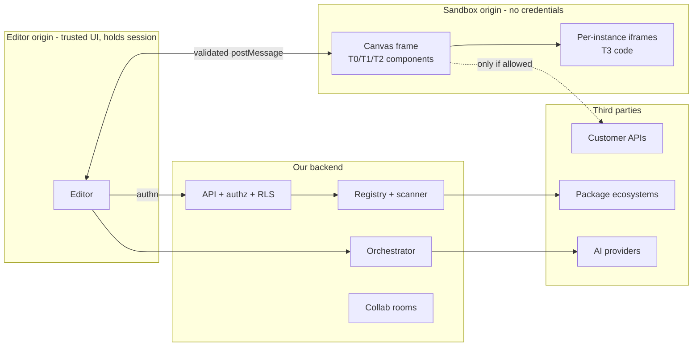

# 12 · Security and threat model (Workstream 13)

## Assets

Customer project IP (IR, assets), credentials & secrets (session tokens, provider keys, project secrets), tenant data isolation, integrity of generated apps (supply chain), AI budgets (money), audit trail integrity, availability.

## Trust boundaries

Every arrow crossing a boundary carries **schema-validated data**, never code, and never credentials from a more-trusted side to a less-trusted one.

## Current-codebase findings (fix early)

| # | Finding | Where | Severity | Fix |
|---|---|---|---|---|
| F1 | AI/user-authored markup rendered with `dangerouslySetInnerHTML`, props substituted by regex → stored XSS in the editor origin | `src/components/CustomComponentRenderer/CustomComponentRenderer.jsx:67-72` | **High** | Stop rendering custom JSX strings; convert to schema compositions, or render only in a T3 sandbox iframe |
| F2 | Backend API key check accepts any string ≥ 10 chars; key accepted in query string (leaks to logs) | `backend/middleware/auth.js` | High (if deployed) | Don't deploy `backend/` publicly; replace with real auth (stage 2) |
| F3 | 50 MB JSON/urlencoded bodies; permissive rate limit (1000/15 min/IP) | `backend/server.js` | Medium | Limits per route (IR ≤ 5 MB, as `parseProject` enforces) |
| F4 | `request` actions can hit any URL; fine in a browser (CORS) but becomes SSRF the moment a server proxy or server-side render executes them | `src/runtime/engine.js` | Medium (future) | Egress policy + server proxy with allowlist and private-IP blocking |
| F5 | Good existing controls to keep: prototype-key rejection, size/depth caps, `safeURL`, `on*`/`dangerouslySetInnerHTML`/`srcDoc` stripping, CSS token filtering | `project.js`, `engine.js`, `Runtime.jsx`, `theme.js` | — | Keep and move into core validators |

## Threats (STRIDE-oriented) and boundaries

| Threat | Scenario | Primary boundary (not just validation) | Secondary controls |
|---|---|---|---|
| **Malicious plugin/component** | Component steals tokens, reads other projects, mines crypto, exfiltrates IR | Runs only on sandbox origin with no cookies/tokens; CSP `connect-src` limited to declared `permissions.network`; T3 in opaque-origin per-instance iframe | SRI, immutable versions, publisher identity, scanning, org approval, kill-switch (yank + block list pushed to editors) |
| **Malicious AI output** | Proposes script URLs, external data sources, deletes pages, huge trees | AI has no write path; ops validated by core; human approval; restricted ops denied | Size caps, URL/CSS lint, taint → RequireApproval |
| **XSS** | Prop value ``; token value with `url(javascript:)`; link `href="javascript:"` | React escaping + prop sanitising at the runtime; untrusted content rendered on sandbox origin; strict CSP on editor (`script-src 'self'`, no `unsafe-eval` — note current ONNX/WebLLM bundles use eval; isolate them in a worker/iframe) | `safeURL`, token filters, Trusted Types on editor origin |
| **Arbitrary code execution** | JSON with expressions; plugin eval | JSON has no code by design (declarative `$`-operators only); handlers are registered code | Lint for `Function`/`eval` in first-party code |
| **SSRF** | Server-side export/thumbnail/proxy fetches `http://169.254.169.254` | Egress through a single fetch gateway: allowlisted schemes, DNS resolution + private/link-local/loopback IP blocking, re-check after redirects, no redirects to private | Timeouts, size caps, per-org egress allowlist |
| **Dependency/supply-chain** | Compromised npm package in builder, in component bundles, or in exported apps | Lockfiles + pinned versions; component bundles are **built by us** in isolated CI from source (P2 marketplace) or uploaded prebuilt with SRI; exported apps pin versions | `npm audit`/OSV scanning, provenance (npm provenance/Sigstore), Renovate with review, minimal deps |
| **Secret leakage** | API keys in IR, in exports, in AI prompts, in logs | Secrets never in IR: `{ "$secret": "NAME" }` references resolved server-side only ([ADR-0014](adr/0014-secrets-by-reference.md)) | Secret scanners on import/export; log redaction; BYO provider keys stay in session memory |
| **Prompt injection** | Label text tells the model to add an external resource | Capability containment + approval ([06](06-ai-guardrails.md)) | Taint, fencing untrusted content |
| **Cross-tenant access (IDOR)** | Guessing project ids | Authz on every request + Postgres RLS by `org_id` | UUIDs, tests that assert 404 across tenants, per-cell isolation later |
| **Broken authorization** | Viewer calls op endpoint; AI acts beyond user | Central `authorize()`; actor model (ai-run ⊂ user); server re-validates approval tokens | Permission matrix tests, audit |
| **Compromised AI provider** | Provider returns malicious output or leaks prompts | Output treated as untrusted data (same as injection); data minimisation; per-org provider allowlist; local models option | Contracts/DPAs, region pinning |
| **Uploaded files** | SVG with script, polyglot files, huge images | Serve uploads from sandbox/asset origin with `Content-Disposition` and correct `Content-Type`, `X-Content-Type-Options: nosniff`; sanitize SVG (or rasterize) | Size/type allowlist, image re-encoding, malware scan (stage 3) |
| **Malicious APIs (customer data sources)** | API returns HTML/script to be rendered; huge responses | Data rendered as text by default; HTML props require explicit sanitizer component | Response size/time limits in runtime |
| **Marketplace packages** | Typosquatting, update-to-malware | Scoped names, verified publishers, manual review for T2, staged rollout of new versions, projects pinned via lockfile | Reporting, yanking, telemetry on permission use |
| **Denial of wallet** | Script burns AI budget | Budgets and rate limits per user/org; platform keys off by default in stage 1 | Anomaly alerts |
| **Repudiation** | "AI did it" | Journal with actor, approval, op ids; append-only audit table | Export to WORM storage (stage 3) |

## AI-specific threats

Covered in [06](06-ai-guardrails.md). The key structural property: *the worst a model can do is propose a ChangeSet that a human rejects*.

## Security requirements for P0

1. Core validators reject (not just strip) forbidden props, unsafe URLs, unsafe CSS, unknown component types.
2. F1 fixed: custom-component JSX strings are no longer rendered in the editor origin.
3. Orchestrator cannot import `ops.apply`/persistence (architecture test).
4. BYO API keys are memory/session-only, never written to IndexedDB, exports, or telemetry.
5. CSP for the editor documented and enforced in hosting headers; eval-requiring AI libraries isolated in a worker.
6. Import path: size cap, prototype-key rejection, schema + migration, secret scan warning.
