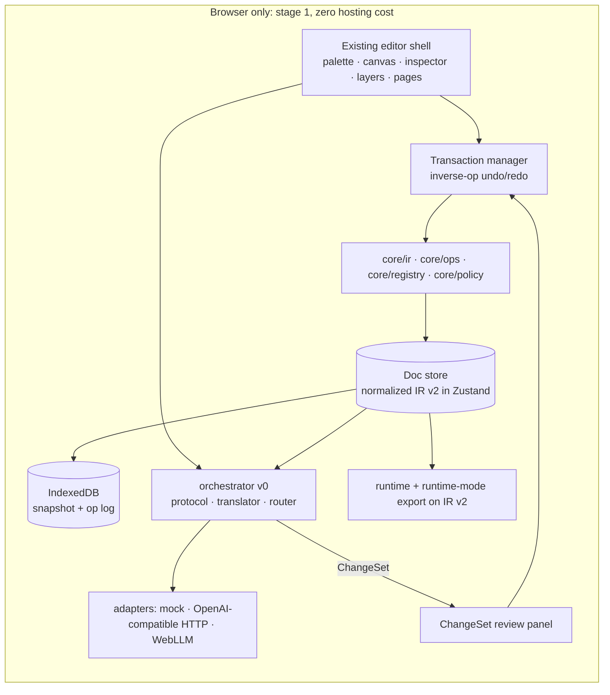
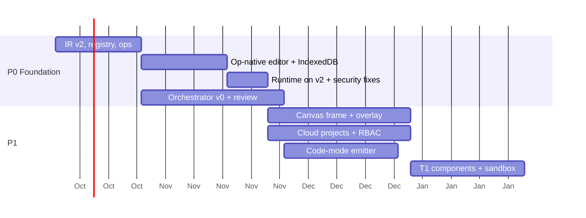

# 16 · Prioritized roadmap, smallest first architecture, implementation order

## Smallest coherent first architecture ("Foundation")

The smallest thing that preserves the long-term vision is **not** a backend, a marketplace or a new canvas. It is the deterministic core that everything else plugs into, plus one end-to-end AI flow that proves the guardrail model.

What is in it:
1. **IR v2** (normalized, canonical, v1 import via migrator).
2. **Core ops** with validate/apply/invert and transactions; all editor writes go through them.
3. **One component registry** of manifests for the 24 built-ins (replaces four registries).
4. **Doc store + inverse-op undo** replacing snapshot history; IndexedDB persistence with migration from `localStorage`.
5. **UI AI Orchestrator v0** in the browser: intent protocol subset, translator, dry-run validation, capability ladder, adapters (mock for tests, one OpenAI-compatible HTTP adapter which also covers Ollama/LM Studio/vLLM and many hosted providers, existing WebLLM).
6. **ChangeSet review** (accept all / selected with dependency closure / reject) applied as one transaction, recorded in a local journal.
7. **Runtime and runtime-mode export** reading IR v2.
8. **Security fixes and architecture tests**: F1 (unsafe custom renderer), dependency rules, CSP headers documented.

What is deliberately **not** in it: backend/accounts, sandbox origin, third-party components, overlay gesture engine, code-mode emitter, collaboration. Each has a defined seam (frame protocol, manifest `source`, op log, emitter interface) so adding it later is additive.

## Implementation order (stories, one at a time)

| # | Story (see [17](17-epics-and-stories.md)) | Why this position |
|---|---|---|
| 1 | E1-S1 IR v2 schema, canonical serializer, v1→v2 migrator with golden tests | Everything depends on the model |
| 2 | E3-S1 Manifest schema + built-in manifests; palette, inspector and AI registry read from it | Ops validation needs the registry |
| 3 | E2-S1 Op engine: schemas, apply/invert/validate, transactions | Single mutation path |
| 4 | E4-S1 Doc store + transaction manager; route canvas/inspector/layers/pages/import through ops; inverse-op undo | Makes the editor op-native |
| 5 | E4-S2 IndexedDB persistence (snapshot + op log), migrate `react-ui-builder:pages-state` | Durable local history; sync-ready |
| 6 | E12-S1 Runtime and runtime-mode export on IR v2 (JSON export stays importable both ways) | Keeps shipping path green |
| 7 | E13-S1 Retire unsafe custom renderer (F1), architecture dependency tests, CSP headers | Close known hole before AI grows |
| 8 | E5-S1 Orchestrator core: protocol schemas, translator, dry-run validator, mock adapter | AI path testable without any model |
| 9 | E5-S2 Adapter contract + OpenAI-compatible adapter + WebLLM adapter; capability ladder; router | Provider independence proven with ≥2 adapters |
| 10 | E6-S1 ChangeSet review panel with dependency closure; apply as one transaction; local journal | The guardrail UX |
| 11 | E5-S3 Context index L0–L3 + read-only retrieval tools | Large projects |
| 12 | E6-S2 Budgets, timeouts, restricted ops policy, taint → RequireApproval | Completes guardrails |

After #12 the Foundation is complete; P1 begins.

## Roadmap by priority

| Priority | Theme | Epics / stories | Exit criteria |
|---|---|---|---|
| **P0 — foundation** | Core model, ops, registry, op-native editor, AI v0 with review, runtime on v2, security fixes | E1, E2, E3-S1, E4-S1/S2, E5-S1..S3, E6-S1/S2, E12-S1, E13-S1 | [18](18-phase1-acceptance-criteria.md) all green |
| **P1 — important next** | Figma-grade canvas (frame + overlay gestures, auto-layout controls, multi-select, copy/paste, infinite canvas with breakpoint frames); components/instances/variants; code-mode React emitter; cloud projects (accounts, Postgres, sync, versions); RBAC & sharing; comments & presence; org components (T1) with sandbox origin; observability | E7, E3-S2/S3, E12-S2, E8, E9, E11-S1, E10-S1, E14 | Two-person team can build, share and export a multi-page form app; T1 component loads without builder redeploy |
| **P2 — scaling/advanced** | Real-time co-editing; marketplace (T2) with review; Next.js/static emitters; workflows & permissions in IR; embeddings for AI retrieval; per-org AI budgets & routing policies; SSO; cells-ready data layout | E11-S2, E3-S4, E12-S3, E1-S3, E5-S4, E9-S3, E10-S2 | 10k-node documents meet [13](13-scalability.md) targets; marketplace component installable safely |
| **P3 — experiments** | React Native/Vue emitters; ShadowRealm/SES in-realm isolation; branch merge UI; multi-agent AI flows (plan → build → test); sketch frames; code round-trip research | — | Spike reports |

## Milestones

Durations are placeholders for sequencing, not estimates; they assume one developer with AI assistance and will be re-planned after spikes S-01..S-04.
